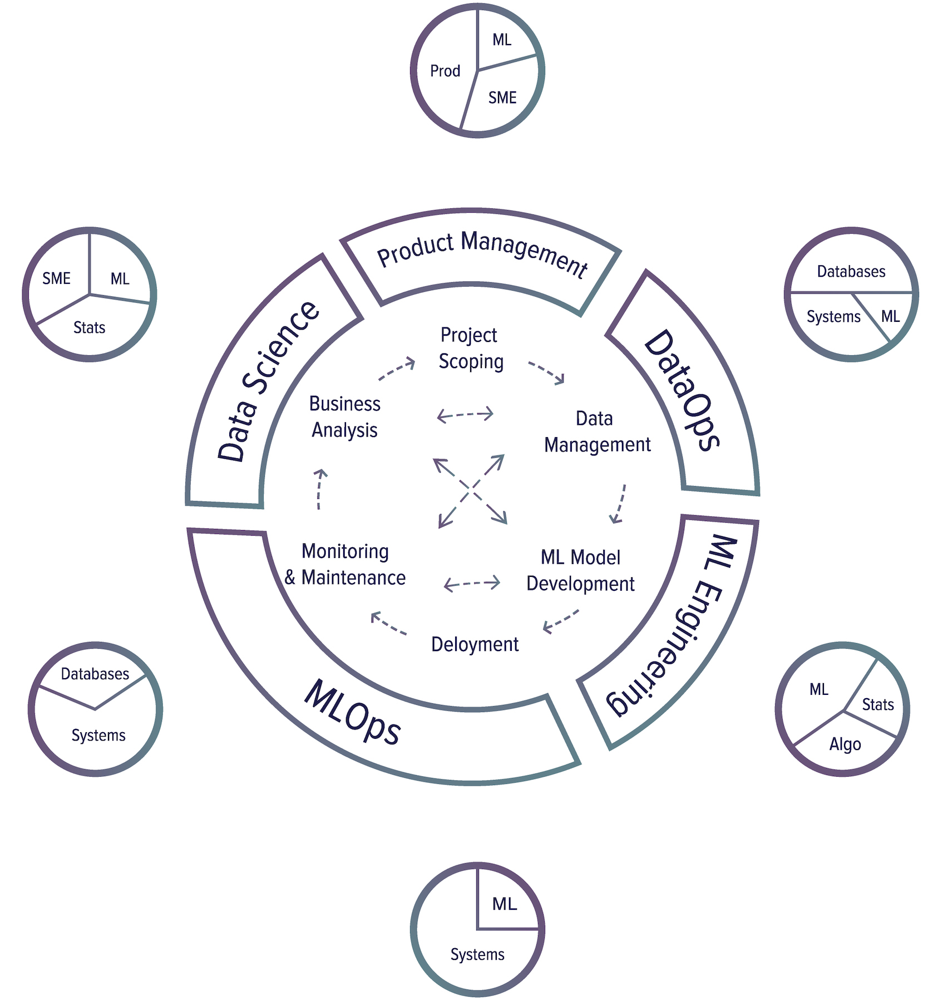

# چرخه تولید

برای درک نقش های مختلف مربوط به یادگیری ماشین در تولید، اجازه دهید ابتدا مراحل مختلف یک چرخه تولید را بررسی کنیم. شش مرحله اصلی در چرخه تولید وجود دارد.

⚠ در مورد مهارت های اصلی لیست شده در هر مرحله ⚠

مهارت‌های اصلی فهرست‌شده در هر مرحله در زیر، بسیاری از افراد را ناراحت می‌کند، همانطور که هر تلاشی برای ساده‌سازی یک موضوع پیچیده و ظریف در چند جمله انجام می‌دهد. این بخش فقط باید به عنوان یک مرجع برای دریافت حسی از مجموعه مهارت های مورد نیاز برای مشاغل مختلف مرتبط با  یادگیری ماشین استفاده شود.

##  محدوده پروژه

یک پروژه با تعیین محدوده پروژه، تعیین اهداف و مقاصد، محدودیت ها و معیارهای ارزیابی شروع می شود. ذینفعان باید شناسایی و درگیر شوند. منابع باید برآورد و تخصیص داده شود.

مهارت های اصلی مورد نیاز: مدیریت محصول، تخصص موضوعی برای درک مشکلات، مقداری دانش ML برای دانستن اینکه ML چه چیزی را می تواند و چه چیزی را نمی تواند حل کند.

## مدیریت اطلاعات

داده‌های مورد استفاده و تولید شده توسط سیستم‌های ML می‌تواند بزرگ و متنوع باشد که برای پردازش و دسترسی سریع و قابل اعتماد، به زیرساخت‌های مقیاس‌پذیر نیاز دارد. مدیریت داده ها منابع داده، فرمت های داده، پردازش داده ها، کنترل داده ها، ذخیره سازی داده ها و غیره را پوشش می دهد.

مهارت های اصلی مورد نیاز: پایگاه های داده/موتورهای پرس و جو برای دانستن نحوه ذخیره/بازیابی/پردازش داده ها، مهندسی سیستم ها برای پیاده سازی سیستم های توزیع شده برای پردازش مقادیر زیاد داده، حداقل دانش ML برای بهینه سازی داده های سازمان برای الگوهای دسترسی ML مفید خواهد بود، اما نه ضروری.

## توسعه مدل ML

از داده های خام، باید مجموعه داده های آموزشی ایجاد کنید و احتمالاً آنها را برچسب گذاری کنید، سپس ویژگی ها را تولید کنید، مدل ها را آموزش دهید، مدل ها را بهینه کنید، و آنها را ارزیابی کنید. این مرحله ای است که به بیشترین دانش ML نیاز دارد و اغلب در دوره های ML پوشش داده می شود.

مهارت های اصلی مورد نیاز: این بخشی از فرآیند است که به بیشترین میزان دانش، آمار و احتمال ML برای درک داده ها و ارزیابی مدل ها نیاز دارد. از آنجایی که مهندسی ویژگی و توسعه مدل نیاز به نوشتن کد دارد، این بخش به مهارت های کدنویسی به ویژه در الگوریتم ها و ساختارهای داده نیاز دارد.

## پس از توسعه یک مدل، باید در دسترس کاربران قرار گیرد.

مهارت های اصلی مورد نیاز: آوردن یک مدل ML به کاربران تا حد زیادی یک مشکل زیرساختی است: چگونه زیرساخت های خود را راه اندازی کنید یا به مشتریان خود کمک کنید تا زیرساخت های خود را برای اجرای برنامه ML خود تنظیم کنند. این برنامه‌ها اغلب به داده، حافظه و محاسبات نیاز دارند. همچنین ممکن است به ML نیاز داشته باشد تا مدل‌های ML را فشرده کند و تأخیر استنتاج را بهینه کند، مگر اینکه بتوانید آنها را به مرحله قبلی فرآیند فشار دهید.

## نظارت و نگهداری

پس از تولید، مدل‌ها باید از نظر کاهش عملکرد نظارت شوند و برای سازگاری با محیط‌های در حال تغییر و نیازمندی‌های در حال تغییر، نگهداری/به‌روزرسانی شوند.

مهارت های اصلی مورد نیاز: نظارت و نگهداری نیز یک مشکل زیرساختی است که به دانش سیستم های کامپیوتری نیاز دارد. نظارت اغلب مستلزم تولید و ردیابی مقدار زیادی از داده های تولید شده توسط سیستم (مانند گزارش ها) است و مدیریت این داده ها مستلزم درک خط لوله(مسیر) داده است.

## تحلیل کسب و کار

عملکرد مدل باید در برابر اهداف تجاری مورد ارزیابی قرار گیرد و برای ایجاد بینش تجاری تجزیه و تحلیل شود. سپس می توان از این بینش ها برای حذف پروژه های غیرمولد یا گسترش پروژه های جدید استفاده کرد.

مهارت های اصلی مورد نیاز: این بخش از فرآیند به دانش ML برای تفسیر خروجی ها و رفتار مدل ML، آمار عمیق و دانش احتمال برای استخراج بینش از داده ها، و همچنین تخصص موضوعی برای ترسیم این بینش ها به مشکلات عملی مدل های ML نیاز دارد. قرار است حل کنند.

توضیحات مهارت‌ها:
سیستم ها: مهندسی سیستم به عنوان مثال برای ساختن سیستم های توزیع شده، استقرار کانتینر.

پایگاه های داده: مدیریت داده ها، ذخیره سازی، پردازش، پایگاه های داده، موتورهای جست و جوگر. این ارتباط نزدیکی با Systems دارد زیرا ممکن است برای پردازش مقادیر زیادی از داده ها نیاز به ساخت سیستم های توزیع شده داشته باشید.
ML: جبرهای خطی، الگوریتم های ML و غیره.
الگوریتم: کدگذاری الگوریتمی
آمار: احتمال، آمار
SME: تخصص موضوعی ذهنی
محصول: مدیریت محصول

موفق ترین رویکرد تولید ML که در صنعت دیده ام، توسعه تکراری و تدریجی است. این بدان معنی است که شما واقعا نمی توانید با یک قدم تمام کنید، به مرحله بعدی بروید و دیگر هرگز به آن بر نگردید. در میان مراحل مختلف رفت و آمدهای زیادی وجود دارد.

در اینجا یک گردش کار رایج وجود دارد که ممکن است هنگام ساخت یک مدل ML با آن روبرو شوید تا پیش‌بینی کنید که آیا هنگام وارد کردن یک عبارت جستجو توسط کاربران، آگهی باید نمایش داده شود یا خیر.

8: دعا کردن و گریه کردن نه تنها در لحظاتی کوتاه نبود بلکه در تمام طول پروسه ادامه داشت.

معیاری را برای بهینه سازی انتخاب کنید. به عنوان مثال، ممکن است بخواهید برای نمایش بهینه سازی کنید -- تعداد دفعاتی که یک تبلیغ نشان داده می شود.
داده ها را جمع آوری کنید و برچسب ها را بدست آورید.
ویژگی های مهندسی
آموزش مدل‌ها
در طول تجزیه و تحلیل خطا، متوجه می شوید که خطاها ناشی از برچسب های اشتباه است، بنابراین داده ها را مجدداً برچسب گذاری می کنید.
دوباره آموزش مدل 
در طول تجزیه و تحلیل خطا، متوجه می‌شوید که مدل شما همیشه پیش‌بینی می‌کند که یک تبلیغ نباید نمایش داده شود، و دلیل آن این است که 99.99٪ از داده‌هایی که دارید نمایش داده نمی‌شوند (تبلیغ نباید برای اکثر درخواست‌ها نشان داده شود). بنابراین باید داده های بیشتری را در مورد تبلیغاتی که باید نمایش داده شوند جمع آوری کنید.
دوباره آموزش مدل 
این مدل بر روی داده‌های آزمایشی موجود شما، که تا کنون دو ماه پیش است، عملکرد خوبی دارد. اما روی داده های تست دیروز ضعیف عمل می کند. مدل شما تنزل یافته است، بنابراین باید داده های جدیدتری را جمع آوری کنید.
دوباره آموزش مدل 
استقرار مدل
به نظر می رسد این مدل عملکرد خوبی دارد، اما پس از آن، افراد تجاری در خانه شما را می کوبند و می پرسند که چرا درآمد در حال کاهش است. به نظر می رسد تبلیغات نشان داده می شوند اما افراد کمی روی آنها کلیک می کنند. بنابراین می‌خواهید مدل خود را برای بهینه‌سازی نرخ کلیک تغییر دهید.
از نو شروع کن
افراد زیادی هستند که روی یک پروژه ML در تولید کار خواهند کرد - مهندسان ML، دانشمندان داده، مهندسان DevOps، کارشناسان موضوع (SMEs). آنها ممکن است از پیشینه های بسیار متفاوت، با زبان ها و ابزارهای بسیار متفاوت باشند، و همه آنها باید بتوانند به طور سازنده روی سیستم کار کنند. ارتباط متقابل و همکاری بسیار مهم است.

🌳 نکته 🌳
"""""""""""""""""""""""""""""""""""""""""""""""""""""""""""""""""""""""""""""""""""""""""""""""""""""""""""""""""""""
به عنوان یک نامزد، درک این چرخه تولید مهم است. اول، به شما ایده می دهد که چه کاری باید انجام شود تا یک مدل را به دنیای واقعی بیاورید و نقش های احتمالی در دسترس را داشته باشید. دوم، به شما کمک می‌کند از پروژه‌های ML ای جلوگیری کنید که وقتی سازمان‌های پشت سر آن‌ها، آن‌ها را به گونه‌ای تنظیم نمی‌کنند که امکان توسعه تکراری و ارتباطات متقابل کارکردی را فراهم می‌آورند، شکست می‌خورند.
"""""""""""""""""""""""""""""""""""""""""""""""""""""""""""""""""""""""""""""""""""""""""""""""""""""""""""""""""""""
