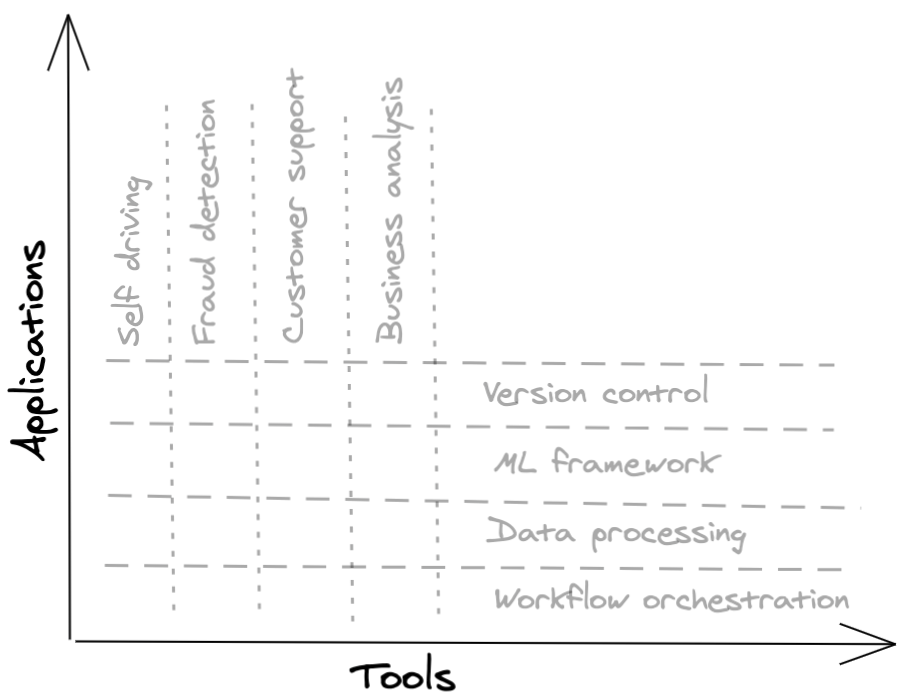

## شرکت های کاربردی در مقابل شرکت های ابزارسازی

👱 داستان شخصی 👱

بعد از انویدیا، من می خواستم به یک استارت آپ که در مراحل اولیه قرار داشت، بپیوندم. من دو استارت آپ هوش مصنوعی را در نظر داشتم که در ظاهر شبیه به هم بودند. هر دو به تازگی جذب سرمایه کرده‌ بودند. هر دو حدود 10 کارمند داشتند که بیشتر آنها مهندس بودند و آماده رشد بیش از حدی نیز داشتند.

استارتاپ A قبلاً سه مشتری داشت، به تازگی اولین فروشنده خود را استخدام کرده بود و آماده بود تا فروشندگان بیشتری را برای فروش تهاجمی استخدام کند. استارتاپ B دو مشتری داشت که آنها را شرکای طراحی می نامیدند و هنوز برنامه ای برای استخدام فروشنده نداشتند. من کار در استارتاپ B را بیشتر دوست داشتم اما فکر می کردم که استارتاپ A چشم انداز فروش بهتری نسبت به استارتاپ B دارد و برای استارتاپ های در مراحل اولیه، فروش برای بقا ضروری است.

وقتی این معضل را به یکی از دوستانم که در شرکت هایی مشابه A و B سرمایه گذاری کرده بود گفتم، به من اشاره کرد که فراموش کردم تفاوت اصلی این دو استارت آپ را در نظر بگیرم: A یک شرکت برنامه های کاربردی بود در حالی که B یک شرکت ابزارسازی بود.

شرکت های برنامه کاربردی برنامه هایی را برای حل یک مشکل تجاری خاص مانند تجزیه و تحلیل کسب و کار یا کشف تقلب ارائه می دهند. شرکت‌های ابزارسازی ابزارهایی را برای کمک به شرکت‌ها در ساخت برنامه‌های کاربردی خود ایجاد می‌کنند. نمونه هایی از ابزارها عبارتند از TensorFlow، Sparks، Airflow، Kubernetes.

در زبان صنعت، یک برنامه کاربردی در محور عمودی نظر گرفته می شود در حالی که ابزار در محور افقی قرار می گیرد.

	

برنامه‌ها احتمالاً توسط کارشناسان موضوعی، که نمی‌خواهند درگیر جنبه‌های مهندسی شوند استفاده می‌شوند (مثلاً بانکدارانی که برنامه‌هایی را برای کشف تقلب می‌خواهند یا نمایندگان مشتریانی که می‌خواهند برنامه‌هایی برای طبقه‌بندی بلیط‌های مشتریان برنامه‌هایی داشته باشند). ابزارها احتمالاً برای استفاده توسط توسعه دهندگان ساخته شده اند. برخی از آنها به صراحت به عنوان ابزارهای devtool شناخته می شوند.

در ابتدا، فروش یک برنامه آسان تر است، زیرا دیدن تأثیر فوری یک برنامه آسان تر است و هزینه اضافی برای پذیرش یک برنامه کاربردی کمتر است. به عنوان مثال، می‌توانید به یک شرکت بگویید که می‌توانید تراکنش‌های تقلبی را با دقت 10 درصد بالاتر شناسایی کنید و شرکت فقط می‌تواند داده‌های آن‌ها را در برنامه شما وارد کند و نتایج را دریافت کند که آیا تراکنش تقلبی است یا خیر.

برای استفاده از ابزار توسط یک شرکت، هزینه های مهندسی زیادی وجود دارد. آنها ممکن است مجبور شوند ابزار موجود خود را تعویض کنند، ابزار جدید را با بقیه زیرساخت های خود ادغام کنند، کارکنان خود را دوباره آموزش دهند یا کارکنان خود را جایگزین کنند. بسیاری از شرکت ها می خواهند منتظر بمانند تا ابزاری قبل از استفاده از آن، مفید بودن و پایداری خود را برای تعداد زیادی از شرکت ها ثابت کند.

با این حال، برای شرکت‌های ابزارسازی، فروش بعداً بسیار آسان‌تر می‌شود. هنگامی که ابزار شما با تعداد کافی مهندس که در آن مهارت دارند و آن را ترجیح می دهند، به حجم بحرانی رسید، ممکن است شرکت های دیگر بدون نیاز به فروش آن به یک کاربر تبدیل شوند. با این حال، دستیابی به این حجم بحرانی برای ابزارهای جدید واقعاً سخت است، و بنابراین، به طور کلی، شرکت های ابزارسازی خطرات بیشتری نسبت به برنامه های کاربردی دارند.

پس از صحبت با دوستم، متوجه شدم که برای شرکتی مانند A طبیعی است که مشتریان بیشتری نسبت به شرکتی مانند B داشته باشد. اما این بدان معنا نیست که A چشم انداز فروش بهتری دارد. در واقع، داشتن دو شرکت بزرگ به عنوان شرکای طراحی نشانه واقعا خوبی برای B است.

یک سال بعد، هر دو شرکت تعداد مشابهی از مشتریان را به دست آوردند و به حدود 30 کارمند رسیدند، اما بیش از نیمی از شرکت A در فروش هستند در حالی که 80٪ شرکت B در مهندسی هستند.

این درک جدید به من کمک کرد تا انتخاب هایم را محدود کنم. از آنجایی که من ابزارهای ساخت و ساز را برای توسعه دهندگان ترجیح می دادم و می خواستم به جای یک سازمان فروش، ابتدا برای یک سازمان مهندسی کار کنم، تصمیم گیری بسیار آسان تر شد.

⚠ ابهام ⚠

این که یک شرکت یک شرکت کاربردی باشد یا یک شرکت ابزارسازی، ممکن است فقط یک استراتژی بازار باشد. برای مثال، شما ابزار جدیدی دارید که می‌تواند موارد استفاده‌ای را که شرکت‌ها هنوز از آن‌ها اطلاعی ندارند را در خود داشته باشد، و می‌دانید که متقاعد کردن شرکت‌ها برای ایجاد تغییرات قابل توجه در زیرساخت‌های موجود برای موارد استفاده نامشخص، سخت است. بنابراین، یک مورد استفاده قانع‌کننده پیدا می‌کنید که بدون ابزار شما قابل انجام نیست، برنامه‌ای را بر اساس آن مورد استفاده می‌سازید و در عوض آن برنامه را می‌فروشید. هنگامی که مشتریان از مفید بودن ابزار شما آگاه شدند، به فروش مستقیم ابزار روی می آورید.

🌳 نکته 🌳

اگر مطمئن نیستید که این نقش شامل کار با یک برنامه کاربردی یا یک ابزار است، در اینجا چند سوال وجود دارد که ممکن است بپرسید.

کاربران اصلی محصول شما چه کسانی هستند؟

موارد استفاده مورد نظر شما چیست؟

شرکت شما چند نفر دارد؟ چند نفر مهندس هستند؟ چند نفر در فروش هستند؟

