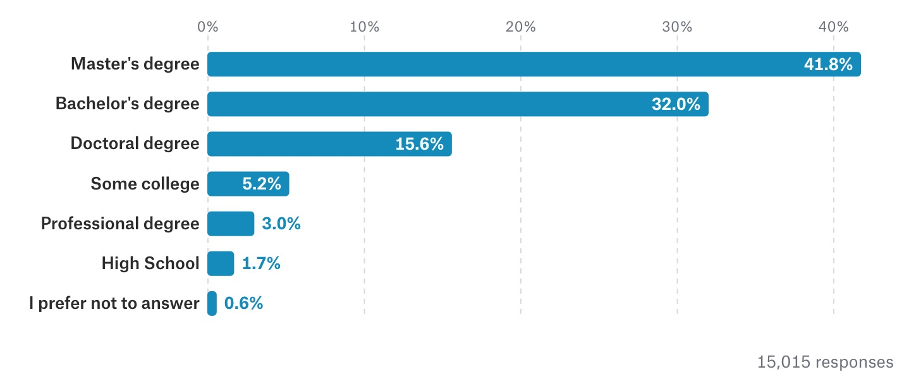

###  آیا به مدرک دکتری نیاز دارم؟ برای کار در یادگیری ماشین؟

نه، شما نیازی به دکترا ندارید. برای کار در یادگیری ماشین

کسانی که فکر می کنند دکتری. مورد نیاز است اغلب پست های شغلی برای دانشمندان پژوهشی استناد می شود که "Ph.D" را فهرست می کند. به عنوان یک نیاز اول، نقش دانشمند پژوهشی بخش بسیار کوچکی از اکوسیستم ML را تشکیل می دهد. هیچ نقش دیگری، از جمله نق محبوب مهندس ML، نیاز به مدرک دکترا ندارد.

حتی برای دانشمندان محقق، منفی های کاذب زیادی وجود دارد. به عنوان مثال، OpenAI، یکی از برترین آزمایشگاه‌های تحقیقاتی هوش مصنوعی در جهان، تنها دو شرط را برای موقعیت دانشمند پژوهشی خود فهرست می‌کند:

سابقه ارائه ایده های جدید در یادگیری ماشین
تجربه گذشته در ایجاد پیاده سازی های با کارایی بالا الگوریتم های یادگیری عمیق (اختیاری)
 22. لیست طولانی افرادی که کارهای شگفت انگیزی در یادگیری ماشین انجام داده اند اما مدرک دکترا ندارند. شامل مدیر ارشد فناوری OpenAI، مخترع اصلی IBM Watson، خالق PyTorch، خالق Keras و غیره است.
شرکت ها می دانند که شما نیازی به مدرک دکترا ندارید. برای انجام تحقیقات ML، اما همچنان به مدرک دکترا نیاز دارید. زیرا این سیگنالی است که شما در مورد تحقیق جدی هستید. در بسیاری از شرکت‌ها، افرادی که رزومه شما را بررسی می‌کنند فنی نیستند و بنابراین به سیگنال‌های ضعیفی مانند Ph.D اهمیت می‌دهند. تصمیم بگیرید که آیا رزومه خود را در اختیار مدیران استخدام قرار می‌دهید یا خیر.

موقعیت های شغلی مهندسی که نیاز به مدرک دکترا داشته باشند رایج نیستند و استثنا هستند. برخی از کاندیداها از اینکه بخاطر نداشتن مدرک دکترا توسط شرکت های بزرگ پذیرفته نشده اند شاکی هستند. مگر اینکه افراد رد شده این را به صراحت بگویند. همچنین نباید ارتباط معنادار(همبستگی) را با علت رخداد اتفاق اشتباه گرفت. افرادی که مدرک دکترا دارند هم رد می شوند.

در نوامبر 2017، Kaggle از 16000 کاربر خود نظرسنجی کرد و دریافت که 15.6٪ از کسانی که در علم داده کار می کنند دارای مدرک دکترا، 41.8٪ فقط دارای مدرک کارشناسی ارشد و 32٪ فقط دارای مدرک لیسانس هستند. با این حال، در میان افرادی که بالاترین درآمد را دارند، 37.3٪ (> 200 هزار دلار در سال) و 41.٪ (150-200 هزار دلار در سال) مدرک دکترا دارند.

اگر در مورد تحقیق جدی هستید، Ph.D. پیشنهاد می شود. با این حال، نباید اجازه دهید که ندانشتن دکترا مانع از درخواست شما برای کار شود. اگر به یک شرکت علاقه دارید، نمونه کارها را ایجاد کنید و درخواست دهید.

22: زمانی که Google AI دفتر خود را در توکیو افتتاح کرد، نیازهای آنها برای دانشمندان محقق شامل مدرک دکترا بود، اما دانشمند پژوهشی مؤسس Google AI توکیو، دیوید ها، دکترا ندارد.

