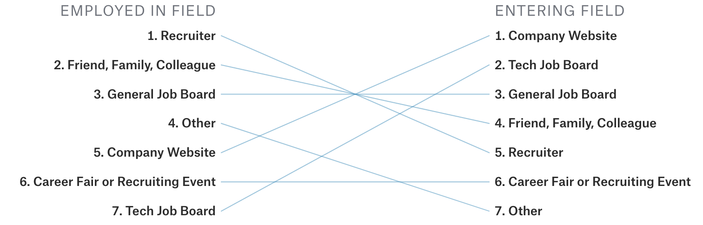

 ### چگونه شرکت ها نامزدها را تامین می کنند

برای استخدام، ممکن است مفید باشد که خود را در جایی قرار دهید که کارفرمایان به دنبال آن هستند. از بین همه کانال‌های ممکن برای یافتن نامزدها، ارجاع‌ها بهترین کانال هستند. استخدام کنندگان مدت طولانی‌ای است که به اتفاق آرا در مورد اثربخشی ارجاعات توافق توافق دارند. در اینجا چندین داده‌های آماری  وجود دارد:

82 درصد از کارفرمایان، ارجاع کارمندان را بالاتر از سایر منابع برای ایجاد بهترین بازگشت سرمایه ارزیابی کردند.
کاندیداهای معرفی‌شده 55 درصد سریع‌تر در مقایسه با نامزدهایی که از طریق سایت‌های شغلی پیدا می‌شوند، استخدام می‌شوند.
میزان ماندگاری کارکنان ارجاع شده پس از دو سال 45 درصد است، در حالی که برای کارکنان هیئت های شغلی 20 درصد است.
کاندیداهای معرفی شده 2.6 تا 6.6 درصد بیشتر احتمال دارد که یک پیشنهاد را بپذیرند](https://www.glassdoor.com/research/studies/interview-sources/.
در تمام مشاغل، ارجاعات 7 درصد درخواست‌ها و 40 درصد از کل استخدام‌ها را تشکیل می‌دهند. اگر به شما ارجاع داده شود، تقریباً 6 برابر بیشتر احتمال دارد که شغل رویایی خود را بدست آورید.
سام آلتمن، مدیر عامل OpenAI و رئیس سابق Y Combinator، نوشت: "با حداقل 10 برابر اختلاف، بهترین منابع نامزدی که تا به حال دیده‌ام، دوستان و دوستان دوستان هستند."

لوکاس بیوالد، بنیانگذار دو استارت آپ یادگیری ماشینی Figure Eight و Weights & Biases، عملکرد 129 استخدام کننده را تجزیه و تحلیل کرد و به این نتیجه رسید که:

«کیفیت ارجاع فوق‌العاده مهم بود – هشت بدترین استخدامی که من در آن‌ها شرکت داشته‌ام، همه برای من و همه افراد شرکت در زمان استخدام ناشناخته بودند… میانگین استخدام یک «ممکن است دوباره استخدام شود» اما یک کارمند متوسط ​​یا شخصی ارجاع "قطعاً دوباره استخدام شد."

تجزیه و تحلیل 15897 بررسی مصاحبه Glassdoor برای نقش‌های مرتبط با مهندسی نرم‌افزار در 27 شرکت بزرگ فناوری نشان داد که: «برای نقش‌های تازه‌کار، حدود 10 تا 20 درصد از نامزدهایی که به سایت‌ها می‌رسند ارجاع داده می‌شوند و اوبر با تقریب 30 درصد در جدول پیشتاز است. برای نقش های ارشد، این تعداد بیشتر است. Salesforce، Uber و Cisco همگی تقریباً 30٪ از نامزدهای ارشد خود را در محل معرفی کرده اند.

نظرسنجی وضعیت علم داده و یادگیری ماشین در سال 2017 توسط Kaggle نشان می‌دهد که در حالی که اکثر افرادی که به دنبال ورود به این حوزه هستند از طریق وب‌سایت‌های شرکت و هیئت‌های شغلی فناوری به دنبال شغل می‌گردند، اکثر افرادی که قبلاً در این زمینه شاغل بوده‌اند، شغل خود را از طریق تماس با استخدام‌کنندگان یا ارجاع‌ها به دست آورده‌اند. .

برای نقش های تازه‌کاربزرگترین منبع برای نامزدهای در محل، استخدام در دانشگاه است. مایکروسافت و اوراکل بیش از نیمی از مصاحبه شوندگان خود را از طریق رویدادهای پردیس مانند نمایشگاه های شغلی و گفتگوهای فناوری استخدام کرده اند. غول های اینترنتی مانند گوگل، فیس بوک و Airbnb کمتر به استخدام در محوطه دانشگاه متکی هستند، اما همچنان بین 20 تا 30 درصد از سایت های آنها را تشکیل می دهد. شرکت‌های بزرگ فناوری تلاش‌های خود را برای استخدام بر روی تعدادی از دانشکده‌های مهندسی محبوب متمرکز می‌کنند: استنفورد، UC برکلی، MIT، Caltech، CMU، دانشگاه تورنتو، و دانشگاه واترلو. دانش آموزان جذب شده از آن مدارس سپس همکلاسی های خود را معرفی می کنند. این دایره ادامه دارد و آن شرکت های فناوری بزرگ را به یک میکسر فارغ التحصیلان Tech Ivy تبدیل می کند.

از دیدگاه کارفرمایان، هدف قرار دادن منابع امیدوارکننده آنها می تواند هزینه استخدام و همچنین خطر استخدام های فاجعه بار را کاهش دهد. بنابراین تعجب آور نیست که پیام پیش فرض برای اکثر نامزدهایی که رزومه خود را از طریق منابع کمتر امیدوارکننده مانند برنامه های آنلاین ارسال می کنند، "متشکرم، بعدی" است. این فرآیند بسیار دور از ایده آل است زیرا محیطی انحصاری و ضد شایسته سالاری ایجاد می کند. بسیاری از افراد واجد شرایط صرفاً به این دلیل رد می شوند که به مدرسه مناسبی نمی روند یا شبکه مناسبی ندارند.

اگر شما یکی از این نامزدهای آماری بدشانس هستید، یکی از چیزهایی که می توانید به آن امیدوار باشید این است که مجموعه ای از مهارت ها و/یا نمونه کارها دارید که جذب کننده ها را جذب می کند. حدود 15 تا 25 درصد از داوطلبان در محل برای نقش‌های جوان در هر شرکت توسط استخدام‌کنندگان تماس می‌گیرند. برای نقش های ارشد، این تعداد دو برابر می شود.

اگر همه چیز شکست خورد، برنامه های خود را ارسال کنید و امیدوار باشید که بهترین ها را داشته باشید. شرکت‌هایی که با متقاضیان آنلاین دوستانه‌تر هستند، توییتر، آمازون و Airbnb هستند که تقریباً نیمی از نامزدهای حضوری آنها متقاضیان آنلاین هستند. فیسبوک، مایکروسافت و اوراکل از جمله شرکت‌هایی هستند که بیشترین احتمال را به متقاضیان آنلاین امیدوار می‌کنند.

