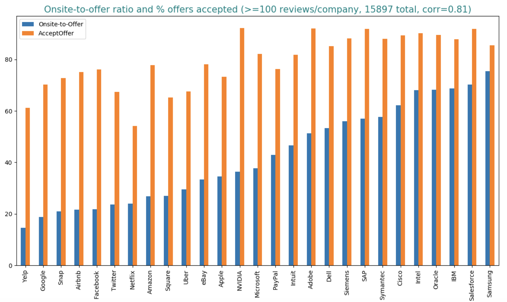

## 2.6 درک شانس خود

هنگام درخواست برای یک نقش، ممکن است تعجب کنید که شانس شما برای آن نقش چقدر است. اگر تصمیمات استخدام از توزیع تصادفی یکنواخت پیروی می کرد، شانس در شرکت های بزرگ فناوری بسیار بد خواهد بود. هر سال، [Google چندین میلیون رزومه دریافت می‌کند و هزاران نفر را استخدام می‌کند](https://www.cnbc.com/2019/04/17/heres-how-many-google-job-interviews-it-takes-to-hire -a-googler.html)، که شانس را حدود 0.2٪ می کند.

با این حال، شانس به طور یکسان برای افرادی که برای یک نقش در همان شرکت درخواست می کنند توزیع نمی شود. این بستگی به مشخصات شما دارد، اینکه آیا شما ارجاع شده اید و چه کسی شما را معرفی کرده است، چقدر شرکت به این نقش نیاز دارد، چه کسی رزومه شما را بررسی می کند، چه کسانی در حال حاضر در خط لوله خود هستند، و سایر متقاضیان چقدر جدی هستند.

شرکت‌ها فلسفه‌های غربالگری بسیار متفاوتی دارند - برخی به هر نامزدی که به وضوح رد صلاحیت نشده‌اند یک صفحه نمایش تلفن می‌دهند، در حالی که برخی فقط به متقاضیان برتر پاسخ می‌دهند.

همه این عوامل، همراه با این واقعیت که تعداد کمی از شرکت‌ها تعداد رزومه‌هایی را که دریافت می‌کنند یا تعداد استخدام‌ها را در هر سال منتشر می‌کنند، تخمین شانس از ارسال درخواست تا دریافت پیشنهاد را غیرممکن می‌سازد.

با این حال، با استفاده از 15897 بررسی مصاحبه برای نقش‌های مرتبط با مهندسی نرم‌افزار در 27 شرکت بزرگ فناوری در Glassdoor تا آگوست 2019، می‌توان نسبت حضور در محل به پیشنهاد، درصد سایت‌هایی را که منجر به پیشنهادات می‌شوند، تخمین زد. این نسبت با نرخ بازده -- درصد نامزدهایی که پیشنهادات خود را در یک شرکت می پذیرند. حتی اگر تخمین برای نقش‌های مهندسی نرم‌افزار باشد، به عنوان نشانه‌ای برای نقش‌های ML عمل می‌کند. سوگیری‌های زیادی در این داده‌ها وجود دارد، اما امیدواریم که تعداد زیادی از بررسی‌ها برخی نویزها را هموار کنند[^49]. اگر همه بررسی‌ها از سوگیری‌های یکسانی رنج می‌برند، همچنان برای مقایسه در بین شرکت‌ها مفید هستند.

داده‌ها نشان می‌دهند که نسبت محل به پیشنهاد از پایین 15% تا بالاترین 70% متغیر است در حالی که نرخ بازده از 50% تا 90% می‌رود. به عنوان مثال، در گوگل، 18.83٪ از سایت ها به پیشنهادات منتهی می شوند و 70٪ پیشنهادات آنها را می پذیرند.

به دلیل سوگیری بررسی های آنلاین، اعداد واقعی باید کمتر باشد. پس از صحبت با استخدام‌کنندگان و انجام تحقیقات گسترده، متوجه شدم که نسبت‌های موجود در محل به پیشنهاد در اینجا چند درصد بیشتر از اعداد واقعی است. برای مثال، [this](https://www.teamblind.com/article/Whats-the-onsite-to-offer-ratio-at-your-company-MsLHK2xF) و [this](https://www. teamblind.com/article/Acceptance-rate-after-Google-on-site-YUokaj7w) ادعا می کند که نسبت حضور در سایت به پیشنهاد برای Google 10-20٪ و آمازون 20٪ است.

نرخ بازدهی پیشنهادی نزدیک به 90 درصد غیرقابل شنیده است. استخدام‌کنندگان شرکت‌هایی با نرخ بازدهی بالا به من گفتند که هدفشان این است که این اعداد را تا 80٪ برسانند. چهار شرکت پیشرو در نمودار عبارتند از NVIDIA، Adobe، SAP و Salesforce. با این حال، شرکت‌هایی مانند Salesforce نامزدهایی را که پیشنهادات آنها را می‌پذیرند تشویق می‌کنند تا نظرات خود را در Glassdoor ارسال کنند، که این امر نرخ بازده واقعی آنها را افزایش می‌دهد.

5 شرکتی که کمترین نسبت حضور به پیشنهاد را دارند، همگی غول‌های اینترنتی هستند - Yelp، Google، Snap، Airbnb و Facebook - که به‌شدت انتخاب‌گر شناخته می‌شوند. شرکت‌هایی با نسبت‌های موجود در محل به پیشنهاد بالا لزوماً غیرانتخابی نیستند. آنها ممکن است در طول فرآیند غربالگری گزینشی تر باشند و فقط با نامزدهایی که واقعاً دوست دارند مصاحبه کنند. سایت‌ها پرهزینه هستند، بنابراین هرچه نسبت حضور در محل به پیشنهاد بالاتر باشد، روند کار از نظر مالی سالم‌تر است.

یک همبستگی قوی (0.81) بین نسبت محل به پیشنهاد و نرخ بازده وجود دارد - هر چه نسبت حضور به پیشنهاد بالاتر باشد، نرخ بازدهی بالاتری خواهد داشت. نامزدی که پیشنهادی از طرف گوگل دریافت می‌کند، نسبت به کاندیدایی که پیشنهادی از شرکتی کمتر انتخابی دریافت می‌کند، احتمال رد آن را بیشتر می‌کند.

دلایل متعددی وجود دارد. اول، اگر نامزدی در مصاحبه‌های شرکت‌های منتخبی مانند گوگل یا فیس‌بوک موفق شود، احتمالاً پیشنهادات جذاب دیگری برای انتخاب دارد. دوم، شرکت‌های منتخب تمایل به ارائه پیشنهادات رقابتی دارند، که این امر کاندیداها را تشویق می‌کند تا از آنها پیشنهاد دریافت کنند تا با شرکت‌هایی که واقعاً می‌خواهند برای آنها کار کنند مذاکره کنند. سوم، فرآیند در آن شرکت ها معمولاً زمان زیادی می برد. تا زمانی که یک نامزد پیشنهاد را دریافت کند، ممکن است قبلاً در شرکت دیگری مستقر شده باشد. آخرین اما نه کم‌اهمیت، از آنجایی که نامزدهای گوگل و فیس‌بوک تنها پس از دریافت پیشنهادات خود با یک تیم مطابقت پیدا می‌کنند، در صورتی که تیم را دوست نداشته باشند، ممکن است پیشنهادات را رد کنند.

---
[^49]:
      برخی از سوگیری ها در این داده ها:

     * تعداد کمی از مردم واقعاً برای هر چیزی به صورت آنلاین نظر می گذارند
     * کسانی که این کار را انجام می دهند احتمالاً توسط یک تجربه واقعاً خوب یا واقعاً بد مجبور می شوند
     * کسانی که پیشنهاد دریافت می کنند بیشتر از کسانی که دریافت نمی کنند، نظر می دهند
     * کسانی که پیشنهادات را می پذیرند احتمالاً نسبت به کسانی که قبول نمی کنند، بازبینی می کنند
     * کاندیداهای جوان بیشتر از کاندیداهای ارشد نظر می دهند

---
*این کتاب توسط [Chip Huyen] (https://huyenchip.com) با کمک won ساخته شده است.