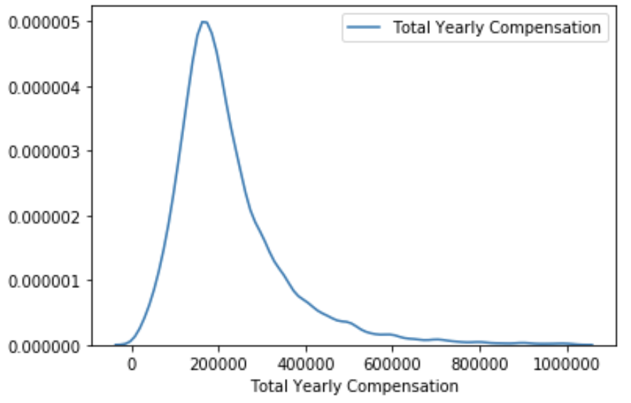
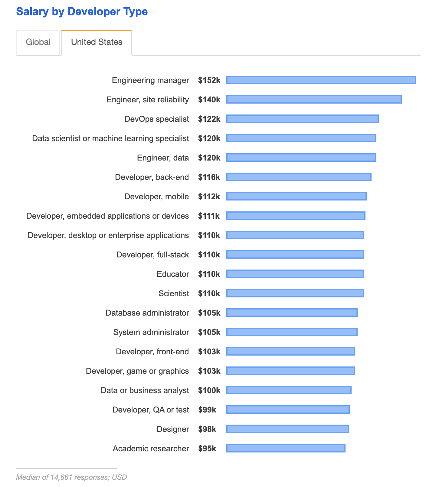

### 3.1 حقوق پایه

در اوایل سال 2020، level.fyi داده‌های خود را با من به اشتراک گذاشت که شامل جزئیات جبران خسارت مستقیم 18.8 هزار کارگر فناوری است. این داده ها متمرکز بر ایالات متحده است و 80٪ از ورودی ها در ایالات متحده (40٪ از کالیفرنیا، 24٪ از ایالت واشنگتن) و 40٪ از شرکت های FAAAM هستند. 65 درصد از ورودی ها مهندسان نرم افزار هستند. 7 شغل محبوب 88 درصد از کل ورودی ها را تشکیل می دهند.

بسته های غرامت گزارش شده از یک توزیع غیرعادی پیروی می کند که درصد کمی از آن درآمدهای غیرمجاز به دست می آورد - کارگران فناوری در هند یا روسیه می توانند زیر 20 هزار دلار درآمد داشته باشند، در حالی که مهندسان برتر در گوگل، فیس بوک و OpenAI می توانند میلیون ها دلار در سال درآمد داشته باشند.

متوسط غرامت سالانه 195000 دلار است در حالی که میانگین آن 225000 دلار است.

<مرکز>

این اعداد بیشتر از نتایج [نظرسنجی StackOverflow در سال 2019] (https://insights.stackoverflow.com/survey/2019#salary) است، که بیان می‌کند در ایالات متحده، متوسط حقوق یک مدیر مهندسی -- پردرآمدترین موقعیت مهندسی در نظرسنجی - 152000 دلار است. این ممکن است به این دلیل باشد که داده های level.fyi متمرکز بر FAAAM است و شامل کل بسته - حقوق پایه، حقوق صاحبان سهام، و پاداش است - در حالی که StackOverflow فقط حقوق را بررسی کرده است.

	

