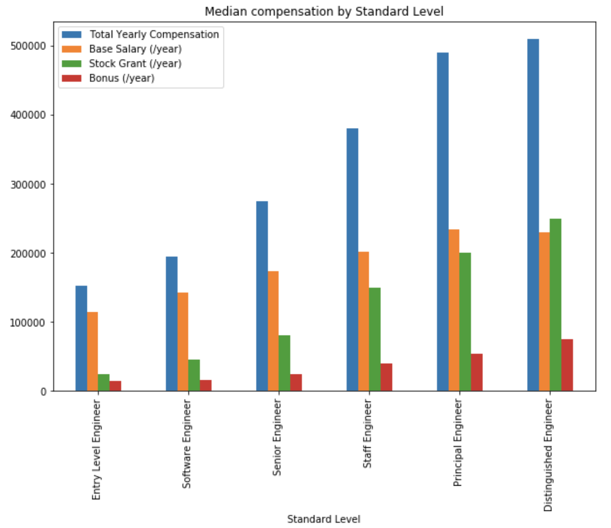

### 3.4 Compensation packages at different levels

As level increases, base salary and bonus increase slowly, but equity increases the most. For junior levels, base salary makes up the largest chunk of your direct compensations. As you level up, the proportion of equity goes up -- higher equity reflects more responsibilities you have towards the company’s success.

	

