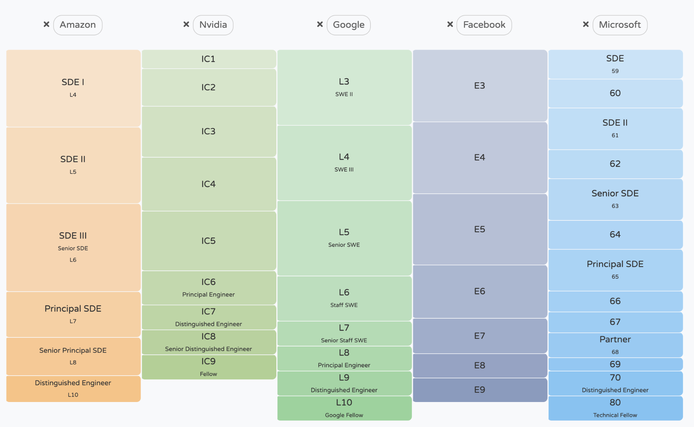

## 3.3 پیشرفت شغلی

> ⚠ این بخش فقط برای شرکت های بزرگ اعمال می شود. در استارت آپ ها، سلسله مراتب مسطح است و سطوح به خوبی تعریف نشده اند. ⚠ 

برای هر پیشنهاد، باید به سطح نیز نگاه کنید. اکثر شرکت‌ها سطوح کاملاً مشخصی برای نقش‌های مهندسی نرم‌افزار خود دارند که نقش‌های ML را در بر می‌گیرد. سطوح بالاتر نشان دهنده غرامت بالاتر، قدرت تصمیم گیری بیشتر و مسئولیت های بیشتر است.

	

شرکت های بزرگ فناوری از نردبان های بسیار متفاوتی پیروی می کنند. به عنوان مثال، نقش‌های مهندسی در Google دارای سطوح از L3 تا L10 هستند، در حالی که فیس‌بوک E3 تا E9، مایکروسافت از 59 تا 80. این سطوح همچنین به یک نردبان استانداردتر نشان داده می‌شوند که شامل:

1. سطح ورودی (کاردانی/جونیور) مهندس
2. مهندس
3. مهندس ارشد
4. مهندس کارکنان
5. مهندس اصلی
6. مهندس برجسته

معمولاً فارغ التحصیلان اخیر کالج از پایین ترین سطح، فارغ التحصیلان کارشناسی ارشد در سطح بالا و Ph.D. فارغ التحصیلان سطح بعدی تفاوت زیادی در حقوق پایه برای همان سطح در همان شرکت وجود ندارد، زیرا حقوق پایه معمولاً برای هر سطح محدود می شود. اما تفاوت های بسیار بیشتری در کمک های مالی وجود دارد که می تواند به طور قابل توجهی از طریق مذاکره تغییر کند.

غیر معمول نیست که می بینیم به نامزدهای قوی سطوح بالاتر از همتایان خود پیشنهاد می شود. گاهی اوقات، ممکن است یک شرکت سطح شما را افزایش دهد تا به شما حقوق پایه بالاتری بدهد تا با پیشنهاد دیگری که ممکن است داشته باشید مطابقت داشته باشد. با این حال، شرکت‌ها ممکن است تمایلی به افزایش سطح استخدام جدید نداشته باشند، زیرا سطح بالاتر به معنای انتظارات بالاتر است، که بسیاری استدلال می‌کنند که می‌تواند بر توانایی آنها برای موفقیت در شرکت تأثیر منفی بگذارد.

تعداد کمی از شرکت ها در نامه های پیشنهادی خود سطوحی را قرار می دهند. اگر بپرسید، استخدام‌کنندگان باید به شما بگویند، زیرا به هر حال متوجه خواهید شد که آیا به آن ملحق می‌شوید یا خیر. این مد است که افراد در فن آوری چیزهایی مانند "عناوین مهم نیست" را بگویند، اما آنها این کار را می کنند. در غیاب یک روش عالی برای ارزیابی توانایی حرفه ای واقعی یک فرد، جامعه به خوبی به عنوان ها پاسخ می دهد. داشتن سطح بالاتر نه تنها به معنای پاداش بیشتر است، بلکه آزادی بیشتر در تصمیم گیری برای کار کردن و قدرت مذاکره بیشتر اگر می خواهید شغل خود را تغییر دهید.

در تئوری، شرکت‌ها باید فکر زیادی برای طراحی سطوح خود داشته باشند و کارمندان باید بتوانند بفهمند که در هر سطح چه انتظاری می‌رود و چه کاری می‌توانند انجام دهند تا از نردبان بالا بروند. اگر نمی دانید، با مدیر خود صحبت کنید. می‌توانید آن را به سادگی بیان کنید: «_من می‌خواهم حرفه‌ام را اینجا بسازم و مسئولیت‌های بیشتری را در شرکت بپذیرم. برای در نظر گرفتن من برای سطح بعدی چه چیزی از من نیاز دارید؟_"

برای اطلاعات بیشتر در مورد سطوح مهندسی، [چیزهایی که درباره سطوح مهندسی باید بدانید] (https://charity.wtf/2020/09/14/useful-things-to-know-about-engineering-levels/) را بررسی کنید (رشته های خیریه، 2020).