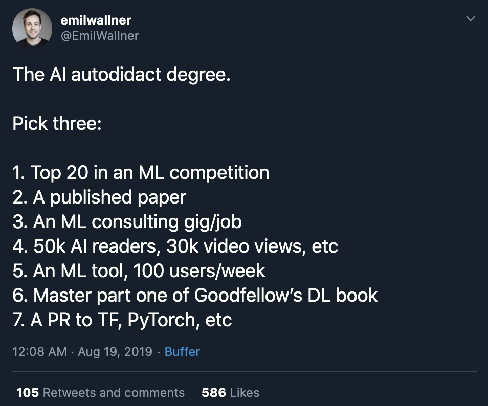

## 4.2 How other people did it

I find it helpful to follow people whose careers I admire and learn how they got there. There’s no one path to any job -- not all ML researchers did their PhDs and not all ML engineers studied computer science in college or went to college at all. Often, candidates with more unconventional backgrounds are more desirable as they can bring fresh perspectives to the team.

Many people have written about their career paths. Here are some of the stories that I found inspiring.

1. [Shifting Careers to Autonomous Vehicles: How I moved from debt collection to self-driving cars](https://towardsdatascience.com/how-i-found-my-current-job-3fb22e511a1f)

    Vladimir Iglovikov, Senior Computer Vision Engineer at Lyft on how he got rejected at Google and NVIDIA and had his Tesla offer rescinded because he violated his NDA. He talked about the immigration frustrations that everyone wishing to work in another country can relate to.

2. John Washam on how [he studied full-time for 8 months for a Google interview](https://www.freecodecamp.org/news/why-i-studied-full-time-for-8-months-for-a-google-interview-cc662ce9bb13/) and got rejected before [he got an offer from Amazon](https://startupnextdoor.com/ive-been-acquired-by-amazon/?src=ciu ).
3. After getting laid off, [Emma Ding](https://towardsdatascience.com/how-i-got-4-data-science-offers-and-doubled-my-income-2-months-after-being-laid-off-b3b6d2de6938) analyzed data science job listings, bucketed them into three groups based on their requirements: “Product Analytics”, “Modeling, and “Data Engineering”. She chose to enhance her resume and practice for Product Analytics roles. By the end of two frenzied months, she received a total of 10 interviews, 4 onsite interviews, and 4 job offers at Twitter, Lyft, Airbnb, and a healthcare startup.
4. Emil Wallner, a resident at Google Arts&Culture on [how he self-taught himself to become a machine learning researcher](https://blog.floydhub.com/emils-story-as-a-self-taught-ai-researcher/). His ideal curriculum is: “_Knowing how to code is a prerequisite. Then, I’d spend 1-2 months completing Fast.ai course V3, and spend another 4-5 months completing personal projects or participating in machine learning competitions._”

	

