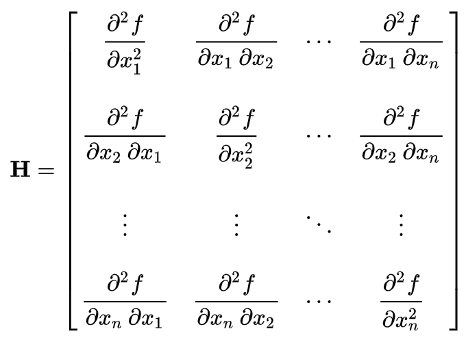

#### 5.1.4 بهینه سازی حساب دیفرانسیل و انتگرال و محدب

_اگر برخی از کاراکترها گم شده اند، به این دلیل است که MathJax به درستی بارگذاری نشده است. بازخوانی صفحه باید آن را برطرف کند._

1. توابع متمایز
     1. [E] وقتی یک تابع قابل تفکیک است به چه معناست؟
     1. [E] زمانی که یک تابع در نقطه ای مشتق ندارد مثال بزنید.
     1. [M] نمونه ای از توابع غیر قابل تمایز را که اغلب در یادگیری ماشین استفاده می شود، بیاورید. اگر آن توابع قابل تمایز نباشند، چگونه انتشار پس‌انداز را انجام دهیم؟
2. تحدب
     1. [E] محدب یا مقعر بودن یک تابع به چه معناست؟ بکشش.
     1. [E] چرا تحدب در یک مسئله بهینه سازی مطلوب است؟
     1. [M] نشان دهید که تابع از دست دادن آنتروپی متقاطع محدب است.
3. با توجه به یک طبقه بندی تفکیک کننده لجستیک:
    
     $$
         p(y=1|x) = \sigma (w^Tx)
     $$
    
     که در آن تابع سیگموئید به صورت زیر داده می شود:

     $$
         \sigma(z) = (1 + \exp(-z))^{-1}
     $$

     ضرر لجستیک برای یک نمونه آموزشی $$x_i$$ با برچسب کلاس $$y_i$$ توسط:
    
     $$
         L(y_i، x_i;w) = -\log p(y_i|x_i)
     $$

     1. نشان دهید که $$p(y=-1|x) = \sigma(-w^Tx)$$.
     1. نشان دهید که $$\Delta_wL(y_i، x_i؛ w) = -y_i(1-p(y_i|x_i))x_i$$.
     1. نشان دهید که $$\Delta_wL(y_i, x_i; w)$$ محدب است.

4. اکثر الگوریتم‌های ML که امروزه استفاده می‌کنیم از مشتقات مرتبه اول (gradients) برای ساختن تکرار آموزشی بعدی استفاده می‌کنند.
     1. [E] چگونه می توانیم از مشتقات مرتبه دوم برای مدل های آموزشی استفاده کنیم؟
     1. [M] مزایا و معایب بهینه سازی مرتبه دوم.
     1. [M] چرا در عمل شاهد بهینه سازی مرتبه دوم بیشتری نیستیم؟
5. [M] چگونه می توانیم از Hessian (ماتریس مشتق دوم) برای آزمایش نقاط بحرانی استفاده کنیم؟
6. [E] نابرابری جنسن اساس بسیاری از الگوریتم‌های استنتاج احتمالی، از جمله انتظار-بیشینه‌سازی و استنتاج متغیر را تشکیل می‌دهد. توضیح دهید که نابرابری جنسن چیست.
7. [ه] قاعده زنجیره را توضیح دهید.
8. [M] اجازه دهید $$x \در R_n$$، $$L = متقاطع(softmax(x)، y)$$ که در آن $$y$$ یک بردار یک داغ است. مشتق $$L$$ را با توجه به $$x$$ بگیرید.
9. [M] با توجه به تابع $$f(x, y) = 4x^2 - y$$ با محدودیت $$x^2 + y^2 =1$$. مقادیر حداکثر و حداقل تابع را پیدا کنید.

----
> در بهینه سازی محدب

بهینه سازی محدب مهم است زیرا تنها نوع بهینه سازی است که ما کم و بیش درک می کنیم. برخی ممکن است استدلال کنند که از آنجایی که بسیاری از توابع هدف رایج در یادگیری عمیق محدب نیستند، ما نیازی به دانستن بهینه سازی محدب نداریم. با این حال، حتی زمانی که توابع محدب نیستند، تجزیه و تحلیل آنها به گونه‌ای که گویی محدب هستند، اغلب کران‌های معنی‌داری به ما می‌دهد. اگر یک الگوریتم با فرض محدب بودن یک تابع ضرر کار نکند، وقتی تابع ضرر غیرمحدب باشد قطعاً کار نخواهد کرد.

تحدب استثناست نه قاعده. اگر از شما بپرسند که آیا تابعی محدب است و قبلاً در لیست توابع محدب رایج شناخته شده نیست، احتمال زیادی وجود دارد که محدب نباشد. اگر می‌خواهید درباره بهینه‌سازی محدب بیاموزید، [کتاب درسی استفن بوید] (http://cs229.stanford.edu/section/cs229-cvxopt.pdf) را بررسی کنید.

----
> در ماتریس Hessian

ماتریس Hessian یا Hessian یک ماتریس مربعی از مشتقات جزئی مرتبه دوم یک تابع با مقدار اسکالر است.

تابع $$f داده می شود: ℝn → ℝ$$. اگر تمام مشتقات جزئی دوم f وجود داشته باشند و در دامنه تابع پیوسته باشند، ماتریس هسی H از f یک ماتریس nn مربع است به طوری که: $$H_{ij}=\frac{\delta f}{\delta x_i\delta x_j}$$.

<مرکز>
     

Hessian برای مسائل بهینه سازی در مقیاس بزرگ در روش های نوع نیوتن و روش های شبه نیوتنی استفاده می شود. همچنین معمولاً برای بیان عملگرهای پردازش تصویر در پردازش تصویر و بینایی کامپیوتری برای کارهایی مانند تشخیص لکه و نمایش سیگنال چند مقیاسی استفاده می شود.