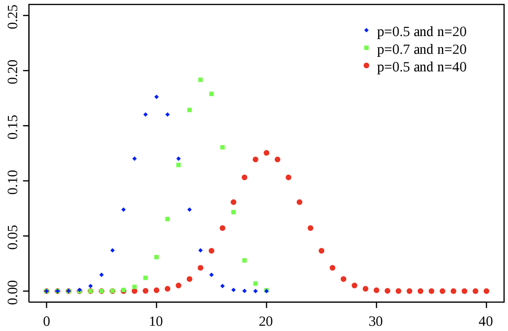

##### 5.2.1.1 مفاهیم اساسی برای مرور

_اگر برخی از کاراکترها گم شده اند، به این دلیل است که MathJax به درستی بارگذاری نشده است. بازخوانی صفحه باید آن را برطرف کند._

###### متغیر تصادفی
به طور رسمی، یک متغیر تصادفی یک تابع قابل اندازه گیری $$X است: \Omega \rightarrow E$$ از مجموعه ای از نتایج ممکن $$\Omega$$ به یک فضای قابل اندازه گیری $$E$$. احتمال اینکه $X$$ مقداری را در یک مجموعه قابل اندازه گیری $$S \subseteq E$$ بگیرد به صورت زیر نوشته می شود:

$$P(X \in S) = P({\omega \in \Omega | X(\omega) \in S})$$، که در آن $$P$$ اندازه‌گیری احتمال روی $$(\Omega، F) $$.

تصادفی بودن از تصادفی بودن نتایج در $$\Omega$$ ناشی می شود.

به طور غیررسمی، متغیر تصادفی متغیری است که به طور احتمالی مقادیر متفاوتی به خود می گیرد. شما می توانید یک متغیر تصادفی را مانند یک متغیر در یک زبان برنامه نویسی در نظر بگیرید. آنها مقادیر می گیرند، انواع دارند و دامنه هایی دارند که در آنها قابل اعمال هستند.

_متغیر تصادفی_ یک مفهوم کلی است. تقریباً همه چیز در زندگی را می توان با استفاده از یک متغیر تصادفی توصیف کرد. زمانی که برای رفت و آمد به محل کار شما طول می کشد یک متغیر تصادفی عادی است. تعداد افرادی که قبل از پیدا کردن شریک زندگی خود قرار می گذارید، یک متغیر تصادفی هندسی است.

###### توزیع احتمال
توزیع احتمال تابعی است که نتایج احتمالی یک متغیر تصادفی را همراه با احتمالات مربوط به آن توصیف می کند.

###### متغیر تصادفی عادی
همچنین به عنوان متغیر تصادفی گاوسی شناخته می شود، این مهم ترین متغیر تصادفی است. با یک متغیر تصادفی پارامتر شده، با میانگین $$\mu$$ و واریانس $$\sigma^2$$ پارامتر می شود.

$$
X \sim N(\mu، \sigma^2) \\
f(x) = \frac{1}{\sigma\sqrt{2\pi}}\exp(-\frac{(x-\mu)^2}{2\sigma^2})
$$

اصطلاحی که می خواهیم در این تابع به آن بپردازیم $$-\frac{(x-\mu)^2}{2\sigma^2}$$ است. به طور شهودی، مقدار را بسیار دور از میانگین مجازات می کند، اما زمانی که واریانس بالا باشد، مجازات کمتر است. عبارت $$\frac{1}{\sigma\sqrt{2\pi}}$$ عادی سازی است به طوری که در 1 ادغام می شود.

$$
E[X] = \mu \\
Var(X) = \sigma^2
$$

در اینجا PDF توزیع نرمال با پارامترهای مختلف است.

<مرکز>

###### توزیع طبقه بندی شده
توزیع مقوله ای که با نام توزیع چند نولی نیز شناخته می شود، تعمیم توزیع برنولی است. نتایج احتمالی یک متغیر تصادفی را توصیف می‌کند که می‌تواند یکی از $$k$$ دسته‌های ممکن را با احتمال هر دسته به طور جداگانه مشخص کند.

$$
X \in \text{Cat}(\phi); \phi = (p_1، p_2، ...، p_k) \text{ و }\sum_{i=1}^kp_i = 1
$$

###### متغیر تصادفی دو جمله ای
یک متغیر تصادفی دوجمله ای تعداد موفقیت ها را در n آزمایش مستقل متوالی نشان می دهد که هر کدام با احتمال $$p$$ موفق بوده و با احتمال $$1-p$$ شکست می خورند. یک مثال، تعداد هدها در ورق زدن سکه $n$n$ است که هر کدام با احتمال 0.5 فرود سر هستند. توزیع دو جمله ای مبنایی برای آزمون دو جمله ای برای معناداری آماری است. هنگامی که تنها 1 آزمایش وجود دارد، به عنوان توزیع برنولی شناخته می شود.
$$
X \sim \text{Bin}(n، p) \\
P(X=k) = {n \انتخاب k} p^k(1-p)^{n-k} \\
E[X] = np \\
Var(X) = np(1-p)
$$

در زیر PMF توزیع دوجمله ای با پارامترهای مختلف آورده شده است.

<مرکز>

###### متغیر تصادفی چند جمله ای
متغیر تصادفی چند جمله ای تعمیم توزیع دو جمله ای است. به جای اینکه فقط دو نتیجه داشته باشد مانند یک چرخش سکه، می تواند چندین نتیجه داشته باشد مانند یک قالب k طرفه. وقتی تعداد آزمایش‌ها 1 باشد، توزیع طبقه‌بندی است.
$$
X \sim \text{Multi}(n, \pi) \text{ با } \pi = (p_1,p_2, ..., p_k ) \text{ و }\sum_{i=1}^kp_i = 1 \ \
P(X=(x_1، x_2، ...، x_k)) = \frac{n!}{x_1!x_2! ... x_k!} \prod_{i=1}^kp_i{x_i} \text{ با } n = \sum_i^kx_i \\
E[X_i] = np_i \\
Var(X_i) = np_i (1-p_i)
$$

###### متغیر تصادفی پواسون
توزیع پواسون، به نظر من، در میان توزیع‌های جالب‌تر است. احتمال وقوع تعداد معینی از رویدادها در یک بازه زمانی ثابت را بیان می کند اگر این رویدادها با نرخ ثابت شناخته شده رخ دهند. این نرخ به عنوان $$\lambda$$ نشان داده می شود. توجه داشته باشید که توزیع پواسون _Memoryless_ است، به این معنی که احتمال وقوع یک رویداد مستقل از زمان پس از آخرین رویداد است.

یک دیدگاه بسیار دقیق این است که توزیع پواسون را تقریبی از دوجمله ای ببینیم که در آن $$n$$ بزرگ است، $$p$$ کوچک است، و $$\lambda = np$$. به عنوان مثال، یک متغیر تصادفی دوجمله ای از 10000 آزمایش با میزان موفقیت 0.01 را می توان به عنوان یک متغیر تصادفی پواسون از رویدادهایی که هر 100 آزمایش * 0.01 = 10000 اتفاق می افتد مشاهده کرد.

$$
X \sim \text{Poi}(\lambda) \\
P(X=i) = \frac{\lambda^i}{i!}e^{-\lambda} \\
E[X] = \لامبدا \\
Var(X) = \lambda \\
$$

در زیر PMF توزیع پواسون با مقادیر مختلف $$\lambda$$ است که توسط Skbkekas ساخته شده است.

<مرکز>
<img src="images/image21.png" width="70%" al