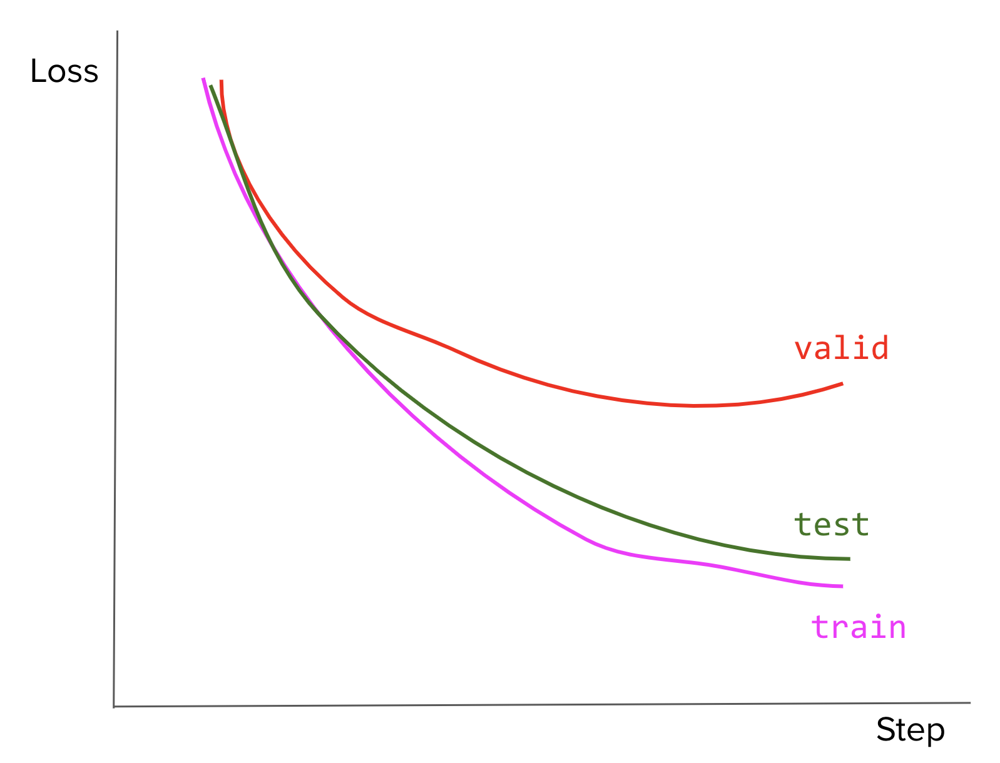

### 7.3 توابع هدف، معیارها و ارزیابی

1. همگرایی.
     1. [E] وقتی می گوییم یک الگوریتم همگرا می شود، همگرایی به چه معناست؟
     1. [E] چگونه بفهمیم که یک مدل چه زمانی همگرا شده است؟
1. [E] منحنی‌های تلفات را برای بیش‌برازندگی و عدم تناسب رسم کنید.
1. مبادله سوگیری-واریانس
     1. [E] مبادله بایاس واریانس چیست؟
     1. [M] این مبادله چگونه به بیش از حد و کم تناسب مرتبط است؟
     1. [M] از کجا می دانید که مدل شما واریانس بالا، تعصب کم است؟ در این مورد چه می کنید؟
     1. [M] چگونه می دانید که مدل شما واریانس کم، سوگیری زیاد است؟ در این مورد چه می کنید؟
1. اعتبار متقابل.
     1. [E] روش های مختلف برای اعتبارسنجی متقابل را توضیح دهید.
     1. [M] چرا ما اعتبار متقاطع بیشتری را در یادگیری عمیق نمی بینیم؟
1. آموزش، معتبر، تقسیم آزمون.
     1. [E] چه اشکالی دارد با آموزش و آزمایش یک مدل بر روی داده های مشابه؟
     1. [E] چرا به یک مجموعه اعتبار سنجی در بالای یک مجموعه قطار و یک مجموعه آزمایشی نیاز داریم؟
     1. [M] منحنی‌های تلفات مدل شما در قطار، مجموعه‌های معتبر و آزمایشی به این شکل هستند. علت این امر چه می توانست بوده باشد؟ شما چکار انجام خواهید داد؟

   <مرکز>
     
   

1. [E] تیم شما در حال ساختن سیستمی برای کمک به پزشکان در پیش بینی سرطان یا نبودن یک بیمار از اسکن اشعه ایکس است. همکار شما اعلام می کند که اکنون مشکل حل شده است که آنها سیستمی ساخته اند که می تواند با دقت 99.99 درصد پیش بینی کند. چگونه به آن ادعا پاسخ می دهید؟
1. امتیاز F1.
     1. [E] مزیت F1 نسبت به دقت چیست؟
     1. [M] آیا همچنان می‌توانیم از F1 برای مشکلی با بیش از دو کلاس استفاده کنیم؟ چگونه؟
1. با توجه به یک طبقه بندی باینری که خروجی ماتریس سردرگمی زیر است.
   <جدول>
     <tr>
      <td>
      </td>
      <td>
   درست پیش بینی شد
      </td>
      <td> نادرست پیش بینی شده است
      </td>
     </tr>
     <tr>
      <td> واقعی است
      </td>
      <td>30
      </td>
      <td>20
      </td>
     </tr>
     <tr>
      <td> واقعی نادرست
      </td>
      <td>5
      </td>
      <td>40
      </td>
     </tr>
   </table>

   1. [E] دقت مدل، فراخوانی و F1 را محاسبه کنید.
   1. [M] برای بهبود عملکرد مدل چه کاری می توانیم انجام دهیم؟
1. طبقه بندی را در نظر بگیرید که در آن 99٪ داده ها متعلق به کلاس A و 1٪ از داده ها متعلق به کلاس B هستند.
     1. [M] اگر مدل شما 100% مواقع A را پیش بینی کند، امتیاز F1 چقدر خواهد بود؟ **نکته**: امتیاز F1 زمانی که A به 0 و B به 1 ترسیم می شود با امتیاز F1 زمانی که A به 1 و B به 0 نگاشت می شود متفاوت است.
     1. [M] اگر مدلی داشته باشیم که A و B را به صورت تصادفی (یکنواخت) پیش بینی می کند، F1 مورد انتظار چقدر خواهد بود؟
1. [M] برای رگرسیون لجستیک، چرا از دست دادن گزارش بیش از MSE (میانگین مربع خطا) توصیه می شود؟
1. [M] چه زمانی باید از RMSE (ریشه میانگین مربعات خطا) نسبت به MAE (میانگین مطلق خطا) و بالعکس استفاده کنیم؟
1. [M] نشان دهید که احتمال ورود به سیستم منفی و آنتروپی متقاطع برای کارهای طبقه بندی باینری یکسان است.
1. [M] برای کارهای طبقه‌بندی با بیش از دو برچسب (مانند MNIST با 10 برچسب)، چرا آنتروپی متقابل تابع ضرر بهتری نسبت به MSE است؟
1. [E] زبانی را با الفبای 27 کاراکتر در نظر بگیرید. حداکثر آنتروپی این زبان چقدر خواهد بود؟
1. [E] بسیاری از مدل‌های یادگیری ماشینی با هدف تقریبی توزیع‌های احتمالی هستند. فرض کنید P توزیع داده ها و Q توزیعی است که توسط مدل ما آموخته شده است. چگونه می توان اندازه گیری کرد که Q چقدر به P نزدیک است؟
1. MPE (محتمل ترین توضیح) در مقابل MAP (حداکثر A پسینی)
     1. [E] MPE و MAP چگونه متفاوت هستند؟
     1. [H] مثالی از زمانی که آنها نتایج متفاوتی را تولید می کنند، بیاورید.
1. [E] فرض کنید می‌خواهید مدلی برای پیش‌بینی قیمت سهام در 8 ساعت آینده بسازید و قیمت پیش‌بینی‌شده هرگز نباید بیش از 10 درصد از قیمت واقعی کاهش یابد. از کدام معیار استفاده می کنید؟

     **نکته**: MAPE را بررسی کنید.

---
> در صورتی که به تجدید آنتروپی اطلاعات نیاز دارید، در اینجا توضیحی بدون هیچ گونه ریاضی وجود دارد.

> بالاخره والدینت به تو اجازه می دهند حیوان خانگی را به فرزندی قبول کنی! آنها تمام آخر هفته را برای یافتن حیوان خانگی شما را به پناهگاه های حیوانات خانگی مختلف می برند.

> پناهگاه اول فقط سگ دارد. وقتی پدرت برایت حیوانی را انتخاب می کند، مادرت چشمانت را می پوشاند. برای اینکه بدانید این حیوان یک سگ است نیازی نیست چشمان خود را باز کنید. حدس زدنش سخت نیست

> پناهگاه دوم هم سگ دارد و هم گربه. دوباره مادرت چشمانت را می پوشاند و پدرت یک حیوان را انتخاب می کند. این بار باید بیشتر فکر کنید تا حدس بزنید کدام حیوان است. شما حدس می زنید که سگ است و پدرتان می گوید نه. پس حدس می زنید که گربه است و حق با شماست. برای اینکه مطمئن شوید چه حیوانی است باید دو حدس بزنید.

> پناهگاه بعدی بزرگترین پناهگاه از همه آنهاست. آنها انواع مختلفی از حیوانات دارند: سگ، گربه، همستر، ماهی، طوطی، خوک کوچک ناز، خرگوش، موش خرما، جوجه تیغی، مرغ، حتی اژدهای ریشدار عجیب و غریب! باید نزدیک به صد نوع مختلف حیوان خانگی وجود داشته باشد. حالا واقعا برای شما سخت است که حدس بزنید پدرتان کدام یک را برایتان آورده است. برای حدس زدن حیوان مناسب ده ها حدس لازم است.

> آنتروپی معیاری برای "گسترش" در غواصان است