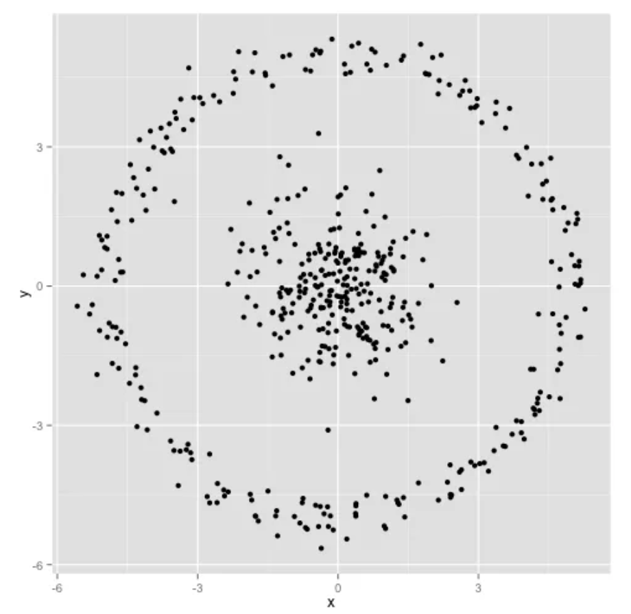
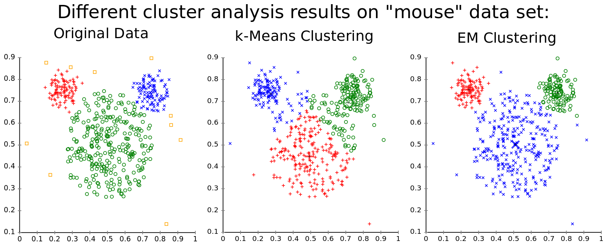
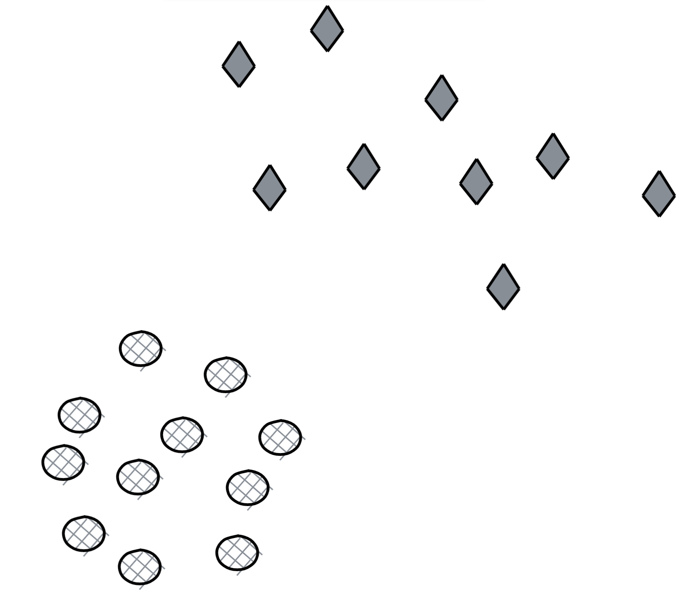
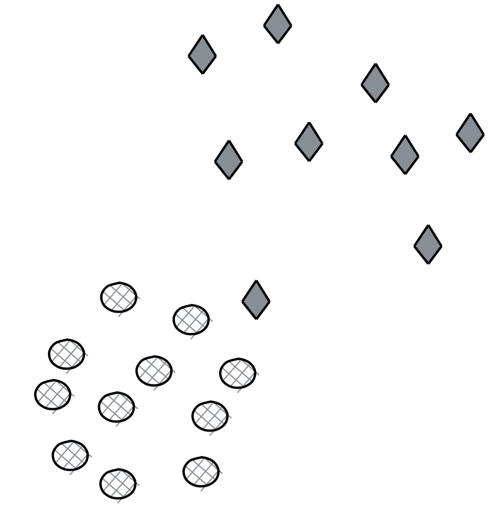
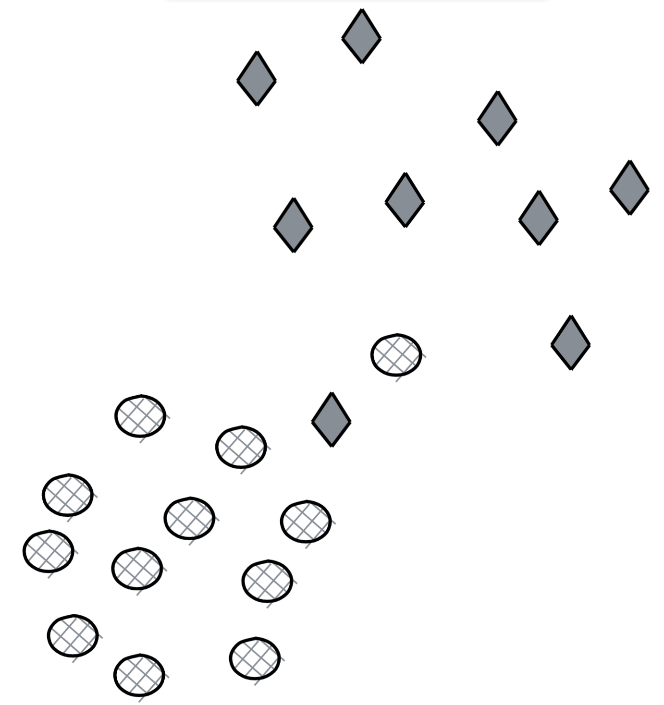

#### 8.1.2 سوالات

1. [E] مفروضات اساسی برای رگرسیون خطی چیست؟
2. [E] اگر مقیاس بندی ویژگی را برای رگرسیون لجستیک اعمال نکنیم چه اتفاقی می افتد؟
3. [E] الگوریتم هایی که هنگام توسعه نمونه اولیه یک مدل تشخیص تقلب استفاده می کنید چیست؟
4. انتخاب ویژگی.
     1. [E] چرا از انتخاب ویژگی استفاده می کنیم؟
     2. [M] برخی از الگوریتم‌های انتخاب ویژگی کدامند؟ مزایا و معایب هر کدام.
5. k-به معنای خوشه بندی.
     1. [E] چگونه مقدار k را انتخاب می کنید؟
     1. [E] اگر برچسب ها شناخته شده باشند، عملکرد الگوریتم خوشه بندی k-means خود را چگونه ارزیابی می کنید؟
     1. [M] اگر برچسب‌ها مشخص نباشند چگونه این کار را انجام می‌دهید؟
     1. [H] با توجه به مجموعه داده زیر، آیا می توانید پیش بینی کنید که خوشه بندی K-means چگونه روی آن کار می کند؟ توضیح.

     <مرکز>
       
     

6. k-نزدیکترین همسایه طبقه بندی.
     1. [E] چگونه مقدار k را انتخاب می کنید؟
     1. [E] وقتی مقدار k را کم یا زیاد می کنید چه اتفاقی می افتد؟
     1. [M] چگونه مقدار k بر بایاس و واریانس تأثیر می گذارد؟
7. k-means و GMM هر دو الگوریتم های خوشه بندی قدرتمندی هستند.
     1. [M] این دو را مقایسه کنید.
     1. [M] چه زمانی یکی را بر دیگری انتخاب می کنید؟
    
     **نکته**: در اینجا نمونه ای از نحوه عملکرد الگوریتم های K-means و GMM در مجموعه داده های مصنوعی ماوس آورده شده است.

     <مرکز>
        
       تصویر از <a href="https://www.mghassany.com/MLcourse/gaussian-mixture-models-em.html">دوره آموزشی محمد قسانی در یادگیری ماشین</a>
     

8. کیسه کشی و بوستینگ دو روش محبوب ترکیبی هستند. جنگل تصادفی یک نمونه کیسه ای است در حالی که XGBoost یک مثال تقویت کننده است.
     1. [M] برخی از تفاوت های اساسی بین الگوریتم های بسته بندی و تقویت چیست؟
     1. [M] چگونه در یادگیری عمیق استفاده می شود؟
9. با توجه به این نمودار جهت دار.
     <مرکز>
        
     

     1. [E] ماتریس مجاورت آن را بسازید.
     1. [E] اگر نمودار اکنون بدون جهت باشد، این ماتریس چگونه تغییر می کند؟
     1. [M] در مورد ماتریس مجاورت دو گراف هم شکل چه می توانید بگویید؟
10. تصور کنید ما یک سیستم فیلتر اشتراکی کاربر-محصول بسازیم تا به هر کاربر اقلامی شبیه به اقلامی که قبلاً خریده است توصیه کنیم.
     1. [M] شما می توانید یک ماتریس کاربر-مورد یا یک ماتریس آیتم-آیتم بسازید. مزایا و معایب هر رویکرد چیست؟
     1. [E] با کاربر جدیدی که در گذشته خریدی انجام نداده است چگونه رفتار می کنید؟
11. [E] آیا مقیاس بندی ویژگی برای متدهای هسته ضروری است؟
12. طبقه بندی کننده ساده لوح بیز.
     19. [E] طبقه بندی کننده Naive Bayes چگونه ساده است؟
     20. [M] بیایید سعی کنیم یک طبقه‌بندی کننده ساده‌لوح بیز بسازیم تا طبقه‌بندی کنیم که آیا یک توییت دارای احساسات مثبت یا منفی است. ما چهار نمونه آموزشی داریم:

       <جدول>
         <tr>
          <td>
       <strong>توئیت</strong>
          </td>
          <td><strong>برچسب</strong>
          </td>
         </tr>
         <tr>
          <td>این من را خیلی ناراحت می کند
          </td>
          <td>منفی
          </td>
         </tr>
         <tr>
          <td>این توله سگ مرا خوشحال می کند
          </td>
          <td>مثبت
          </td>
         </tr>
         <tr>
          <td>به این همستر شاد نگاه کنید
          </td>
          <td>مثبت
          </td>
         </tr>
         <tr>
          <td>همستر در خانه من مجاز نیست
          </td>
          <td>منفی
          </td>
         </tr>
       </table>

     با توجه به طبقه بندی کننده شما، جمله "همستر از توله سگ ناراحت است" چیست؟

13. دو الگوریتم محبوب برای برنده شدن راه حل های Kaggle Light GBM و XGBoost هستند. آنها هر دو الگوریتم های تقویت کننده گرادیان هستند.
     1. [E] تقویت گرادیان چیست؟
     1. [M] تقویت گرادیان برای چه مشکلاتی خوب است؟
14. SVM.
     1. [E] جداسازی خطی چیست؟ چرا وقتی از SVM استفاده می کنیم مطلوب است؟
     1. [M] وانیلی SVM چقدر روی این مجموعه داده کار می کند؟

       <مرکز>
          
       

     1. [M] وانیلی SVM چقدر روی این مجموعه داده کار می کند؟

       <مرکز>
          
       

     1. [M] وانیلی SVM چقدر روی این مجموعه داده کار می کند؟
       <مرکز>
          
       

*این کتاب توسط [Chip Huyen](https://huyenchip.com) با کمک دوستان فوق العاده ساخته شده است. برای بازخورد، اشتباهات و پیشنهادات، می‌توانید با نویسنده [اینجا] (https://huyenchip.com/communication/) تماس بگیرید. حق چاپ ©2021 Chip Huyen.*