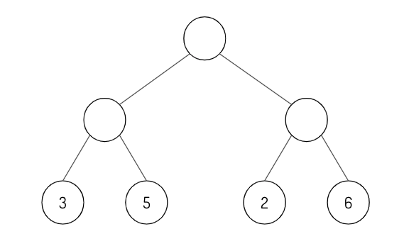

#### 8.2.3 یادگیری تقویتی

> 🌳 **نکته** 🌳 
برای تازه کردن دانش خود در مورد RL عمیق، [Spinning Up in Deep RL] (https://spinningup.openai.com/en/latest/) را بررسی کنید (OpenAI)

28. [E] معاوضه اکتشاف و بهره برداری را با مثال توضیح دهید.
29. [E] چگونه یک افق متناهی یا نامتناهی بر الگوریتم های ما تأثیر می گذارد؟
30. [E] چرا به عبارت تخفیف برای توابع هدف نیاز داریم؟
31. [E] دایره های خالی را با استفاده از الگوریتم minimax پر کنید.

<مرکز>

32. [M] مقادیر آلفا و بتا را با عبور از درخت مینیمکس از چپ به راست پر کنید.

     <مرکز>

33. [E] با توجه به یک سیاست، تابع پاداش را استخراج کنید.
34. [M] جوانب مثبت و منفی سیاست داخلی در مقابل خارج از سیاست.
35. [M] تفاوت بین مدل مبتنی بر و بدون مدل چیست؟ کدام یک از نظر داده کارآمدتر است؟