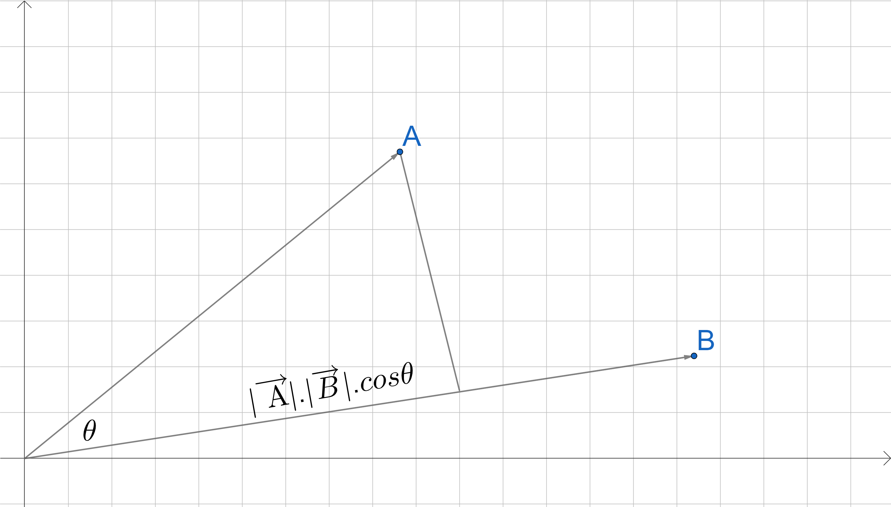

# 5.1.1 Vectors

1. Dot product
    1. [E] What’s the geometric interpretation of the dot product of two vectors?\
       [A] In the geometric context, the dot product of 2 vecotrs is projection of one vector over another. For the given geometric vectors $\overrightarrow A$ and $\overrightarrow B$, their dot product is given by\
           $$\overrightarrow A.\overrightarrow B = |\overrightarrow A|.|\overrightarrow B|.cos\theta$$
<p align="center"></p>


1.
    2. [E] Given a vector $u$, find vector $v$ of unit length such that the dot product of $u$ and $v$ is maximum.\
       [A] Dot product of $\vec{u}$ and $\vec{v}$ is givenby $|\vec{u}|.|\vec{v}|.cos\theta$. Where $|\vec{u}|$ and $\vec{v}$ are the magnitude of the vectors respectively. This dot product will be maximum when $cos\theta$ will be maximum, which occurs when $\theta = 0$ i.e both the vector overlap with each other.\
       Since, $max |\vec{u}|.|\vec{v}|.cos\theta$\
       $= |\vec{u}|.|\vec{v}|.1$\
       $= |\vec{u}|.1$\
       The vector $v$ of unit length to yield max dot product with $u$ is given by 
       $\vec{u}.\vec{v}$ = $= |\vec{u}|$\
       $$\vec{v} = \frac{|\vec{u}|}{\vec{u}}$$
       
3. Outer product
    1. [E] Given two vectors $a = [3, 2, 1]$ and  $b = [-1, 0, 1]$. Calculate the outer product $a^Tb$?\
       [A] Given \
       $$a = [3, 2, 1],    b = [-1, 0, 1]$$\
       Their outer product is given as $a \times b$ which is also known as the 'cross product' given by $a^Tb$

```math
a^Tb = \begin{bmatrix}3\\2\\1\end{bmatrix} \times \begin{bmatrix}-1&0&1\end{bmatrix} = \begin{bmatrix}-3&0&3\\-2&0&2\\-1&0&1\end{bmatrix}
```

2.
     2. [M] Give an example of how the outer product can be useful in ML.\
       [A] Following are the use cases where the outer product of the vectors can be useful in ML.
       1. Measure orthogonality of 2 vectors: Two vectors are said to be orthogonal of the angle between them is $90\degree$ and the outer product among them is maximum.
       2. Correlation between 2 vectors
      
          
3. [E] What does it mean for two vectors to be linearly independent?\
   [A] Linearly independent vectors are orthogonal to each other. In such a situation, angel between the vectors will be $90\degree$. Which means their outer product will be zero.\
   $$\vec{u}\times\vec{v} = |\vec{u}|.|\vec{v}|.sin\theta = 0$$

   
5. [M] Given two sets of vectors $A = {a_1, a_2, a_3, ..., a_n}$ and $B = {b_1, b_2, b_3, ... , b_m}$. How do you check that they share the same basis?\
   [A] In order to check whether two sets of vectors share the same basis, we need to find out the number of independent vectors in their respective vector spaces and compare if they are equal. The set of independent vectors is given by the rank of their augmented matrices.

   $A = {a_1, a_2, a_3, ..., a_n}$ can be written as 
   
```math
A = \begin{bmatrix}a_1\\a_2\\a_3\\a_n\end{bmatrix}
```

   Rank can be found by iteratively performing linear transformation among the rows till we achieve non zero rows those will be the linearly independent rows of the matrix and will be equal to the rank of this matrix.
   
7. [M] Given $n$ vectors, each of $d$ dimensions. What is the dimension of their span?\
   [A] Dimension of the span of $n$ vectors is given by the rank of their augmented matrix.

   
8. Norms and metrics
    1. [E] What's a norm? What is $L_0, L_1, L_2, L_{norm}$?\
       [A] For a given vector space, $V$, the norm is a function $n: V \rightarrow R$ defined to measure the length of a vector. Norm has following properties -
	    1. Non Zero norm : $n(x) \ge 0$ for all $x \in V$ and $x  \neq 0$
  	    2. Scale invariant : $n(\lambda \times x) = |\lambda| \times n(x)$ for all $x \in V$ and for all $\lambda \in R$.
	    3. Triangle inequality : $n(x + y) \le n(x) + n(y)$ for all $x,y \in V$
	
 	    Norm is represented by $||x|| = n(x)$. These are the different types of norms 

	    1. $L_0$ norm: Number of non zero elements in a vector.
	    2. $L_1$ norm (Manhattan Norm): Sum of absolute value of vector elements.\
           		$||x||_1 = \sum{|x_i|}$
	    3. $L_2$ norm (Eucledian Norm): Length of vector in Euclidean space.\
           		$||x||_2 = (\sum{x_i^2})^{\frac{1}{2}}$
	    4. $L_{\infty}$ norm (Maximum norm): Maximum absolute value of vector elemets.\
           		$||x||_{\infty} = max{|x_i|}$
    2. [M] How do norm and metric differ? Given a norm, make a metric. Given a metric, can we make a norm?\
       [A] For a given vector space $V$, metrics is the function $m: V \times V \rightarrow R$ defined to measure the distance between two points in that vector space. The metrics has following properties -
	    1. Non Zero Metric : $m(x,y) \ge 0 \forall x,y \in V$\
    		   $m(x,y) = 0$ when $x = y$
	    2. Symmetric property : $m(x,y) = m(y,x) \forall x,y \in V$
	    3. Triangle inequality : $m(x,y) \le m(x,z) + m(z,y) \forall x,y,z \in V$

	   A metric can be computed using a norm. Given two points $x, y$. The norm of difference of two vectors gives the metric of these points.
   	  $$||x-y|| = m(x,y)$$
    
<!-- Segment break -->

# 5.1.2 Matrices

1. [E] Why do we say that matrices are linear transformations?\
   [A] A linear transformation is a function $g: R^m \rightarrow R^n$ that maps a vector space of dimension $m$ to another vector space of dimension $n$. A linear transformation satisfies following propoerties
   1. Homogenous\
      $g(cx) = cg(x)$
   3. Additive\
      $g(x+y) = g(x) + g(y)$

    When a matrix of dimension $A_{n\times m}$, is multiplied with a vector $v$ of dimension $n$ it results in another vector $u$ of dimension $m$, which inherently a transformation process. 
    $$A_{n\times m}v = u$$
    This transformation via matrices follows the above properties of linearity. Hence matrices are known as linear transformations.
   
2. [E] What’s the inverse of a matrix? Do all matrices have an inverse? Is the inverse of a matrix always unique?\
   [A] Inverse of a matrix $A$ is another matrix $A^{-1}$ such that when multiplied together it yields an identity matrix.
  $$AA^{-1} = I$$
    Identity matrix can be obtained by
   $$A^{-1} = \frac{1}{|A|}Adj(A)$$
   Where $|A|$ is the determinant and $\frac{1}{|A|}Adj(A)$ is the adjoint. For the matrices where the determinant is $0$ the inverse is not defined. Such matrices are also known as *singular matrices*.\
   Inverse of a matrix is always unique.
3. [E] What does the determinant of a matrix represent?\
   [A] The determinant of the matrix is given by
   $$det(A) = |A| = \sum_{i=1}^{n}A_{ij}C_{ij}$$ where $C_{ij}$ is the cofactor matrix. Determinant is only defined for square matrices. It represents the area/volume enclosed between the vectors.
   
4. [E] What happens to the determinant of a matrix if we multiply one of its rows by a scalar $t \times R$?\
   [A] As per the row scaling property, on multiplying one of the rows with a scalar $t$ the resulting determinant will be scaled by $t$. 
   $$det(t\times A) = t\times det(A)$$
   
5. [M] A $4 \times 4$ matrix has four eigenvalues $3, 3, 2, -1$. What can we say about the trace and the determinant of this matrix?\
   [A] Trace of a matrix is given by the sum of it's eigen values.\
   Trace of the matrix : For a diagonal matrix, the sum of all it's diagonal elements.
   $$Tr(A) = \sum_{i=1}^{n}a_{ij}$$
   Eigen values and eigen vectors: For the given relation
   $$AX = \lambda X$$
   $\lambda$ is the eigen value of $A$ and $X$ is eigen vector of A given $X != 0$. The charecteristic equation of $A$ is given by
   $$det(A-\lambda I)=0$$ whose roots give the eigen values of the Matrix $A$ as $\lambda _1$, $\lambda _2$, .. $\lambda _n$
   
6. [M] Given the following matrix:<br>
```math
	\begin{bmatrix}1&4&-2\\-1&3&2\\3&5&-6\end{bmatrix}
```
	
   Without explicitly using the equation for calculating determinants, what can we say about this matrix’s determinant?
	**Hint**: rely on a property of this matrix to determine its determinant.\
        [A] The determinant of this matrix is $0$.
   We can perform some linear transformation to the columns and observe one of the columns can become all $0s$ which will make the determinant to be $0$.
```math
   \begin{bmatrix}1&4&-2\\-1&3&2\\3&5&-6\end{bmatrix} = -2\times \begin{bmatrix}1&4&1\\-1&3&-1\\3&5&3\end{bmatrix} = \begin{bmatrix}1&4&0\\-1&3&0\\3&5&0\end{bmatrix}
```
7. [M] What’s the difference between the covariance matrix $A^TA$ and the Gram matrix $AA^T$?\
   [A] The covariance matrix $A^TA$ is the pair wise inner product of the features/dimensions of the vector space. The diagonal of this matrix is variance of each feature. It is helpful in undertanding the relation of features with each other and can be applied to areas like feature transformation, feature selection, dimensionality reduction, etc. The Gram matrix $AA^T$ is the pair wise inner product of each vector. It is essential in understanding the relation between individual vectors. This is primarily applied in Kernel methods as a kernel function between data points and other applications where similarity between data points in high dimensional space needs to be calculated. 

8. Given $A \in R^{n \times m}$ and $b \in R^n$
	1. [M] Find $x$ such that: $Ax = b$.\
           [A] The solution to x can be given the following when $A$ is a square matrix, i.e, it't determinant exists.
    $$x = A^{-1}b$$
	1. [E] When does this have a unique solution?\
   	   [A] The solution for this equation will not have a unique solution when the matrix $A$ is not invertible. 
	1. [M] Why is it when A has more columns than rows, $Ax = b$ has multiple solutions?\
           [A] When $A$ has more columns than rows, the matrrix $A$ becomes singular matrix and it's determinant is undefined. In that case, either the solution or above equation is non existant or there are infinitely many solutions.
	1. [M] Given a matrix A with no inverse. How would you solve the equation $Ax = b$? What is the pseudoinverse and how to calculate it?\
    	   [A] The solution for equation $Ax = b$ can always be approximated. One such approximation is defined by replacing the actual inverse with a pseudoinverse.
    $$x = A^+b$$
    	       The pseudo inverse also known as 'Moore-penrose inverse' can be calculated through SVD(Singular valued decomposition) of matrix $A$ which decomposed the matrix $A$ as 
    $$A = U\Sigma V^T$$
    Where $U$ is a matrix of dimension $m\times m$, $\Sigma$ is a diagonal matrix of dimension $m\times n$ where the diagonal values are called as the singular values and $V$ is a matrix of dimension $n\times n$. The pseudo inverse of $A$ can be written as
     $$A^+ = V\Sigma^+ U^T$$
    $\Sigma^+$ can be found by reciprocrating the non-zero singular values in $\Sigma$ followed by transposition.
    
9. Derivative is the backbone of gradient descent.
	1. [E] What does derivative represent?\
    	   [A] In case of gradient descent, we compute gradient of the cost function which is partial derivative of the cost function w.r.t each parameter. The derivative represents the direction of the vector denoting highest increase in cost value also known as the 'slope of the curve' or 'rate of change of cost function'.
	1. [M] What’s the difference between derivative, gradient, and Jacobian?\
    	   [A] These 3 are all inter-related terms in linear algebra
    Derivative or first order derivative or differential is a scalar and defined for a univariate function $f(x)$ and is represented as
    $$f'(x) = \frac{df}{dx} = \lim\limits_{h\to \infty}\frac{f(x+h) - f(x)}{h}$$
    Gradient is a generalization term for derivative and is defined for multivariate functions. It is given by a vector of partial differential of the function w.r.t. each variable. For a function $f(x_1, x_2)$ the gradient is given by
    $$\nabla_x f = [\frac{\partial f}{\partial x_1}, \frac{\partial f}{\partial x_2}]$$
    Jacobian is a matrix of partial differentials for a vector valued function $f: R^n \rightarrow R^m$. For a vector valued function
```math
f(x) =
\begin{bmatrix}
f_1(x) \\
f_2(x) \\
\vdots \\
f_m(x)
\end{bmatrix}
```
    
the jacobian $J$ will be given by

```math
J = \nabla_x f = \begin{bmatrix} \frac{\partial f(x)}{\partial x_1} & \dots & \frac{\partial f(x)}{\partial x_n} \end{bmatrix}

= \begin{bmatrix}
\frac{\partial f_1(x)}{\partial x_1} & \dots & \frac{\partial f_1(x)}{\partial x_n} \\
\frac{\partial f_2(x)}{\partial x_1} & \dots & \frac{\partial f_2(x)}{\partial x_n} \\
\vdots & & \vdots\\
\frac{\partial f_m(x)}{\partial x_1} & \dots & \frac{\partial f_m(x)}{\partial x_n}
\end{bmatrix}
```

14. [H] Say we have the weights $w \in R^{d \times m}$ and a mini-batch $x$ of $n$ elements, each element is of the shape $1 \times d$ so that $x \in R^{n \times d}$. We have the output $y = f(x; w) = xw$. What’s the dimension of the Jacobian $\frac{\delta y}{\delta x}$?\
    [A] Since, $y$ is a vector valued function $f(x; w) \in R^{n \times m}$, the Jacobian will be a matrix of dimension $m \times n$ as described in the solution above.
16. [H] Given a very large symmetric matrix A that doesn’t fit in memory, say $A \in R^{1M \times 1M}$ and a function $f$ that can quickly compute $f(x) = Ax$ for $x \in R^{1M}$. Find the unit vector $x$ so that $x^TAx$ is minimal.
	
	**Hint**: Can you frame it as an optimization problem and use gradient descent to find an approximate solution?\
     [A] This can be posed as a constrained optimization problem\
          $$\min x^{T}Ax$$
    	  $$||x|| = 1$$
    In an unconstrained optimization problem, gradient descent can be applied by updating the optimal $x$ in every step with gradient of the function.
    $$x_{k+1} = x_k - \eta \nabla f(x^TAx)$$

    In this case, there is constraint to the optimal value $x^*$. To solve this we can add an additional step to the gradient descent algorithm which projects the optimal value at every step to the constaint space $C$. This projection function, searches for the point on the unit sphere which is closes to the optimal point in that step.
    $$x_{k+1} = P(x_k - \eta \nabla f(x^TAx))$$
    $$P(x) = \arg\min_{z \in C} |x - z|$$
