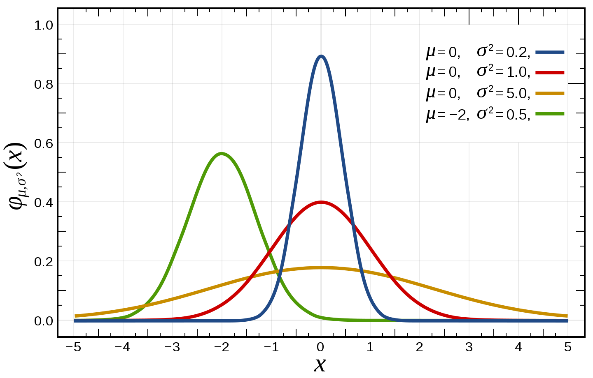
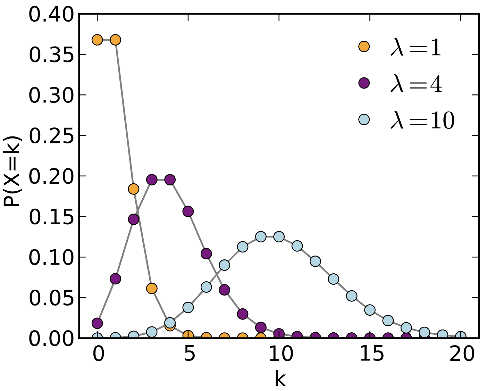

##### 5.2.1.1 Basic concepts to review
###### Random variable
Formally, a random variable is a measurable function $$X: \Omega \rightarrow  E$$ from a set of possible outcomes $$\Omega$$ to a measurable space $$E$$. The probability that $$X$$ takes on a value in a measurable set $$S \subseteq E$$ is written as:

$$P(X \in S) = P({\omega \in \Omega | X(\omega) \in S})$$, where $$P$$ is the probability measure on $$(\Omega, F)$$. 

The randomness comes from the randomness of the outcomes in $$\Omega$$.

Informally, a random variable is a variable that probabilistically takes on different values. You can think of a random variable as being like a variable in a programming language. They take on values, have types, and have domains over which they are applicable.

_Random variable_ is a general concept. Almost everything in life can be described using a random variable. The time it takes you to commute to work is a normal random variable. The number of people you date before finding your life partner is a geometric random variable.

###### Probability distribution
A probability distribution is a function that describes possible outcomes of a random variable along with its corresponding probabilities.

###### Normal random variable
Also known as the Gaussian random variable, this is the single most important random variable. It's parameterized by a random variable, parametrized by a mean $$\mu$$ and variance $$\sigma^2$$.

$$
	X \sim N(\mu, \sigma^2) \\
	f(x) = \frac{1}{\sigma\sqrt{2\pi}}\exp(-\frac{(x-\mu)^2}{2\sigma^2})
$$

The term we want to go over in this function is $$-\frac{(x-\mu)^2}{2\sigma^2}$$. Intuitively, it punishes the value far away from the mean, but the punishment is less when the variance is high. The term $$\frac{1}{\sigma\sqrt{2\pi}}$$ is normalization so that it integrates to 1.

$$
	E[X] = \mu \\
	Var(X) = \sigma^2
$$

Here is the PDF of the normal distribution with different parameters.

	

###### Categorical distribution
Also known as the multinoulli distribution, the categorical distribution is a generalization of the Bernoulli distribution. It describes the possible results of a random variable that can take on one of $$k$$ possible categories, with the probability of each category separately specified.

$$
	X \in \text{Cat}(\phi); \phi = (p_1, p_2, ..., p_k) \text{ and }\sum_{i=1}^kp_i = 1
$$

###### Binomial random variable
A binomial random variable represents the number of successes in n successive independent trials, each succeeding with probability $$p$$ and failing with probability $$1-p$$. One example is the number of heads in $$n$$ coin flips, each with a 0.5 probability of landing head. The binomial distribution is the basis for the binomial test for statistical significance. When there's only 1 trial, it's known as the Bernoulli distribution.
$$
	X \sim \text{Bin}(n, p) \\
	P(X=k) = {n \choose k} p^k(1-p)^{n-k} \\
	E[X] = np \\
	Var(X) = np(1-p)
$$

Below is the PMF of the binomial distribution with different parameters.

	

###### Multinomial random variable
The multinomial random variable is a generalization of the binomial distribution. Instead of having only two outcomes like with a coin flip, it can have multiple outcomes like with a k-sided die. When the number of trials is 1, it's the categorical distribution.
$$
	X \sim \text{Multi}(n, \pi) \text{ with } \pi = (p_1,p_2, ..., p_k ) \text{ and }\sum_{i=1}^kp_i = 1 \\
	P(X=(x_1, x_2, ..., x_k)) = \frac{n!}{x_1!x_2! ... x_k!} \prod_{i=1}^kp_i{x_i} \text{ with } n = \sum_i^kx_i \\
	E[X_i] = np_i \\
	Var(X_i) = np_i(1-p_i)
$$

###### Poisson random variable
The Poisson distribution is, in my opinion, among the more interesting distributions. It expresses the probability of a given number of events occurring in a fixed interval if these events occur with a known constant rate. This rate is denoted as $$\lambda$$. Note that the Poisson distribution is _memoryless_, which means the probability that an event occurs is independent of the time since the last event.

One pretty neat perspective is to see the Poisson distribution as an approximation of the Binomial where $$n$$ is large, $$p$$ is small, and $$\lambda = np$$. For example, a Binomial random variable of 10000 trials with the success rate of 0.01 can be seen as a Poisson random variable of events happening every 10000 * 0.01 = 100 trials.

$$
	X \sim \text{Poi}(\lambda) \\
	P(X=i) = \frac{\lambda^i}{i!}e^{-\lambda} \\
	E[X] = \lambda \\
	Var(X) = \lambda \\
$$

Below is the PMF of the Poisson distribution with different values of $$\lambda$$, made by Skbkekas.

	

> **Poisson vs binomial according to [Data Science Central](https://www.statisticshowto.datasciencecentral.com/poisson-distribution/)**:

> If your question has an average probability of an event happening per unit (i.e. per unit of time, cycle, event) and you want to find the probability of a certain number of events happening in a period of time (or a number of events), then use the Poisson Distribution.

> If you are given an exact probability and you want to find the probability of the event happening a certain number of times out of x (i.e. 10 times out of 100, or 99 times out of 1000), use the Binomial Distribution formula.

###### Geometric random variable
If each trial has the probability of success of p, then the geometric random variable represents the number of independent trials until the first success. One example is the number of candidates you have to interview until you hire someone.

$$
	X \sim \text{Geo}(p) \\
	P(X=n) =(1-p)^{n-1}p \\
	E[X] = \frac{1}{p} \\
	Var(X) = \frac{1-p}{p^2} \\
$$

Below is the PMF of the geometric distribution with different values of $$p$$, made by Skbkekas.

	

###### Beta random variable
Beta is my favorite distribution (what do you mean you don't have a favorite distribution?). It's a random variable that estimates another random variable.

Say, we have a coin with an unknown probability of turning heads. Let $$p$$ represent this probability. After $$n + m$$ flips, we get $$n$$ heads and $$m$$ tails. We might want to estimate that $$p = \frac{n}{n+m}$$. However, this is unreliable, especially if $$n+m$$ is small. We'd like to say something like this: $$p$$ can also be more than, less than, or equal to $$\frac{n}{n+m}$$, the values further away from $$\frac{n}{n+m}$$ having a smaller probability. And the higher the value of $$n+m$$, the higher the probability of $$p$$ being $$\frac{n}{n+m}$$. The beta distribution allows you to do that.

The beta random variable is represented using two variables: $$\alpha$$ to represent the number of successes and $$\beta$$ to represent the number of failures. The beta distribution can represent beyond coin flips. In fact, $$\alpha$$ and $$\beta$$ can rerepsent continuous value (though they can't be non-positive).

$$
	x \sim \text{Beta}(\alpha, \beta) \text{ with } 0 < \alpha, \beta \\
	f(x; \alpha, \beta) = \frac{\Gamma(\alpha + \beta)}{\Gamma(\alpha)\Gamma(\beta)}x^{\alpha-1}(1-x)^{\beta-1}  \text{ with }  0 \leq x \leq 1 
$$

$$\Gamma$$ is the Gamma function: $$\Gamma(n) = (n-1)!$$. The term $$\frac{\Gamma(\alpha + \beta)}{\Gamma(\alpha)\Gamma(\beta)}$$ is the normalization constant so that the expression integrates to 1.

$$
	E[X] = \frac{\alpha}{\alpha + \beta} \\
	Var(X) = \frac{\alpha\beta}{(\alpha + \beta)^2(\alpha + \beta + 1)}
$$

We can also incorporate a priori belief in the beta distribution. For example, if before even flipping the coin, we believe that the coin has a moderate chance of being biased towards heads, we can set the a priori to be $$\text{Beta}(4, 2)$$. Then after 10 coin flips of which 7 are heads and 3 are tails, we can update the distribution to be $$\text{Beta}(4 + 7, 2 + 3) = \text{Beta}(11, 5)$$. In fact, in Bayesian inference, the beta distribution is the conjugate prior probability distribution for Bernoulli, binomial, negative binomial, and geometric distributions.

Below is the PDF of the geometric distribution with different parameters.

	

The multivariate generalization of the beta random variable is called Dirichlet.

###### Exponential family of distributions
A class of distributions is in the exponential family if it can be written in the form:

$$
	p(x; \eta) = h(x)\exp(B(\eta)T(x) - a(\eta))
$$
where:
1. $$\eta$$ is the parameter of the distribution, e.g. if it's the normal distribution then $$\eta = (\mu, \sigma)$$.
1. $$T(x)$$ is the sufficient statistic. For most distributions, $$T(x) = x$$. For the beta distribution, $$T(x) = (\log x, \log(1-x))$$.
1. $$a(\eta)$$ is the normalization constant so that the expression integrates to 1.

The exponential family of distribution is important because it provides a general framework for working with many of the most common distributions, including the Bernoulli, binomial, Poisson, normal, and more.

You can write the PMF and PDF of those distributions to match the form defined above. For example, given the Poisson random variable $$\text{Poi}(\lambda)$$, with $$f(x) = \frac{\lambda^x}{x!}\exp(-\lambda)$$, belongs to the exponential family because $$f(x)$$ can be written in the form $$h(x)\exp(B(\eta)T(x) - a(\eta))$$.
$$
	f(x) = \frac{\lambda^x}{x!}\exp(-\lambda) = \frac{1}{x!}\exp(\log(\lambda)x - \lambda) \\
	\eta = \lambda \\
	h(x) = \frac{1}{x!} \\
	B(\eta) = \log(\eta) \\
	T(x) = x \\
	a(\eta) = \lambda
$$

More examples that show that other distributions belong to the exponential family can be found [here](https://www2.stat.duke.edu/courses/Spring11/sta114/lec/expofam.pdf) and [here](http://cs229.stanford.edu/notes/cs229-notes1.pdf).

###### Marginal distribution, joint distribution, conditional distribution
A joint probability distribution gives the probability of two or more events happening at the same time. For example, given two discrete random variables $$X$$ and $$Y$$, the joint probability distribution of $$X$$ and $$Y$$ gives the probability of $$P(X=x, Y=y)$$ for any combination of value $$x \in X$$ and value $$y \in Y$$.

A marginal distribution gives the probabilities of various values of a subset of variables without reference to the values of the other variables. For example, given the joint distribution of $$X$$ and $$Y$$, we want to have a marginal probability distribution of $$X$$ without reference to $$Y$$. 

$$
	P(X=x) = \sum_yP(X=x, Y=y)
$$

A conditional probability distribution gives the probability of a subset of events occurring assuming that other events also occur. One example is $$P(X|Y)$$.

---
*This book was created by [Chip Huyen](https://huyenchip.com) with the help of wonderful friends. For feedback, errata, and suggestions, the author can be reached [here](https://huyenchip.com/communication/).*