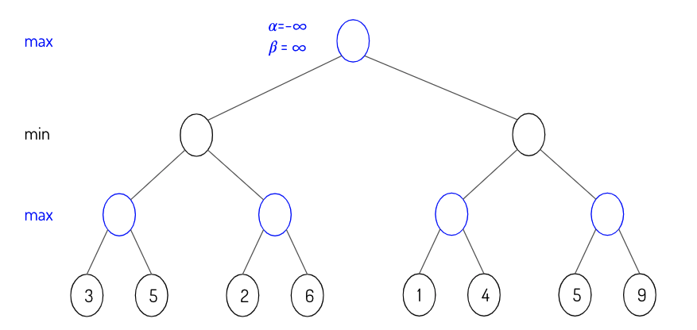

#### 8.2.3 Reinforcement learning

> 🌳 **Tip** 🌳 
To refresh your knowledge on deep RL, checkout [Spinning Up in Deep RL](https://spinningup.openai.com/en/latest/) (OpenAI)

28. [E] Explain the explore vs exploit tradeoff with examples.
29. [E] How would a finite or infinite horizon affect our algorithms?
30. [E] Why do we need the discount term for objective functions?
31. [E] Fill in the empty circles using the minimax algorithm.

	

		
	

32. [M] Fill in the alpha and beta values as you traverse the minimax tree from left to right.

    

		
	

33. [E] Given a policy, derive the reward function.
34. [M] Pros and cons of on-policy vs. off-policy.
35. [M] What’s the difference between model-based and model-free? Which one is more data-efficient?